# Technical Design Document: Regulatory Intelligence Assistant for Public Service

**Version:** 1.0  
**Date:** November 19, 2025  
**Project:** G7 GovAI Grand Challenge - Statement 2 (Navigating Complex Regulations)  
**Status:** Draft - Challenge Submission

## 1. Architecture Overview

### 1.1 High-Level System Architecture

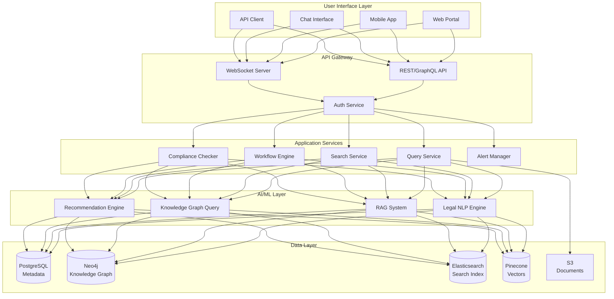

### 1.2 2-Week MVP Architecture Decisions

**Simplified Stack for Rapid Development:**
- **Frontend:** React SPA with simple search/Q&A interface
- **Backend:** FastAPI (Python) monolith with modular structure
- **AI:** Gemini API for RAG + legal NLP
- **Search:** Elasticsearch for keyword + vector search
- **Knowledge Graph:** Neo4j Community Edition
- **Deployment:** Docker containers on single cloud instance

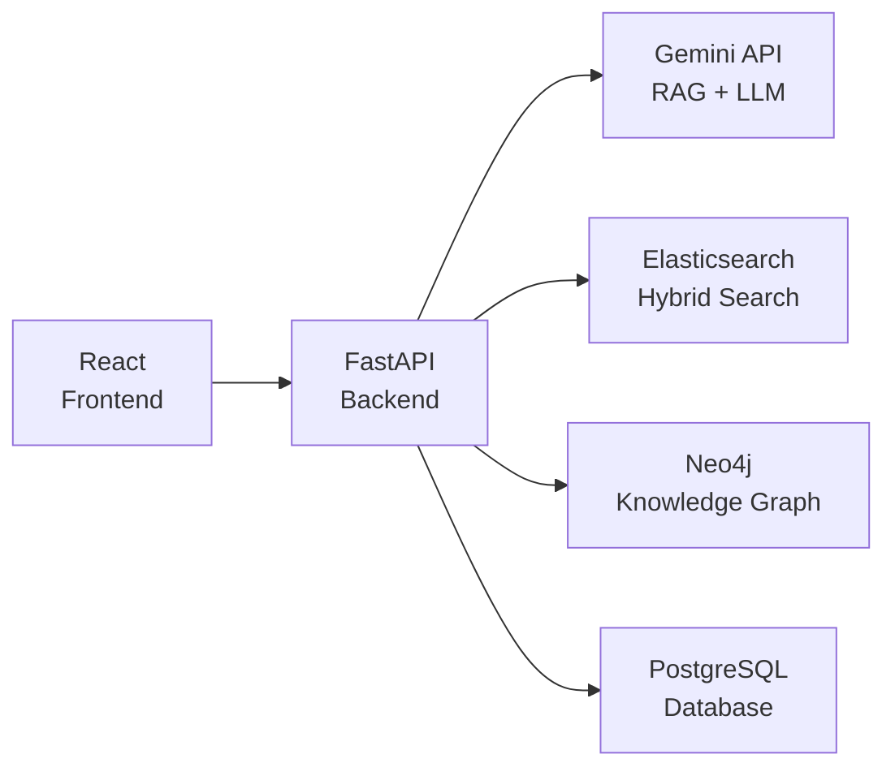

## 2. Component Design

### 2.1 Regulatory Knowledge Graph

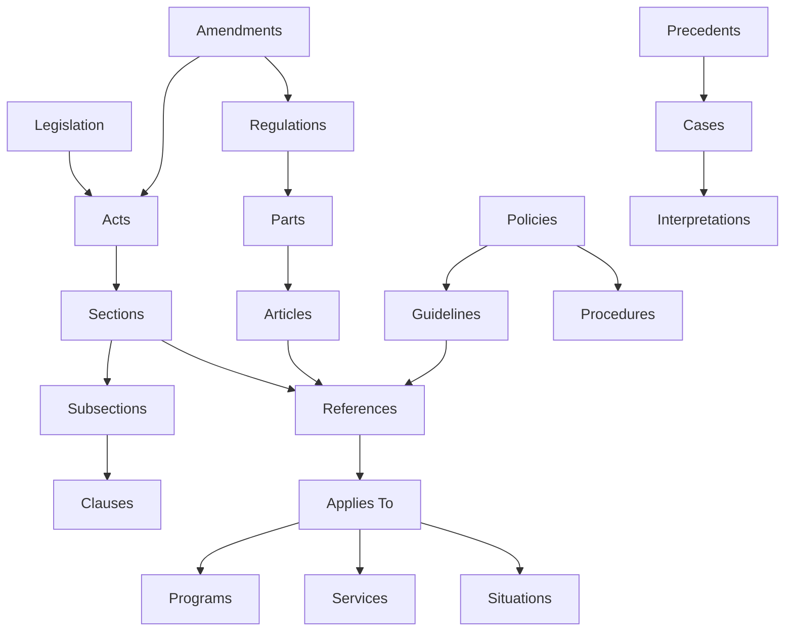

**Knowledge Graph Schema (Neo4j):**

```cypher
// Node types
(:Legislation {id, title, jurisdiction, effective_date, status})
(:Section {id, number, title, content, parent_id})
(:Regulation {id, title, authority, effective_date})
(:Policy {id, title, department, version})
(:Program {id, name, department})
(:Situation {id, description, tags})

// Relationship types
(:Legislation)-[:HAS_SECTION]->(:Section)
(:Section)-[:REFERENCES]->(:Section)
(:Section)-[:AMENDED_BY]->(:Section)
(:Section)-[:APPLIES_TO]->(:Program)
(:Section)-[:RELEVANT_FOR]->(:Situation)
(:Regulation)-[:IMPLEMENTS]->(:Legislation)
(:Policy)-[:INTERPRETS]->(:Legislation)
```

**Key Components:**

1. **DocumentIngester**
   - Purpose: Parse and structure legal documents
   - Formats: PDF, HTML, DOCX, XML (LegalDocML)
   - Output: Structured nodes and relationships

2. **GraphBuilder**
   - Purpose: Construct knowledge graph from structured data
   - Features: Automatic relationship extraction, entity linking
   - Updates: Incremental updates for amendments

3. **GraphQueryService**
   - Purpose: Query knowledge graph for relevant regulations
   - Cypher queries: Find paths, shortest paths, related nodes
   - Caching: Redis cache for common queries

### 2.2 Legal NLP Engine

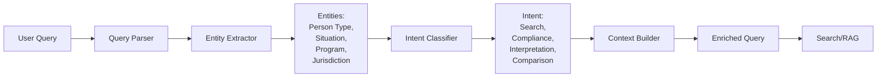

**NLP Components:**

1. **QueryParser**
   - Tokenization and normalization
   - Stop word removal (preserving legal terms)
   - Synonym expansion (legal terminology)
   - Query reformulation for better recall

2. **EntityExtractor**
   - Named Entity Recognition for legal entities
   - Person types (citizen, resident, temporary worker, etc.)
   - Programs and services
   - Jurisdictions (federal, provincial, municipal)
   - Temporal expressions (dates, deadlines)

3. **IntentClassifier**
   - Classify query intent (search, compliance check, interpretation)
   - Route to appropriate service
   - Determine response format needed

**Implementation:**

```python
class LegalNLPEngine:
    def __init__(self):
        self.entity_extractor = EntityExtractor()
        self.intent_classifier = IntentClassifier()
    
    async def process_query(self, query: str, context: dict) -> dict:
        """Process user query and extract structured information"""
        
        # Parse and normalize
        tokens = self.tokenize(query)
        
        # Extract entities
        entities = await self.entity_extractor.extract(query)
        
        # Classify intent
        intent = await self.intent_classifier.classify(query, entities)
        
        # Build enriched context
        enriched_query = {
            'original_query': query,
            'normalized_query': ' '.join(tokens),
            'entities': entities,
            'intent': intent,
            'user_context': context
        }
        
        return enriched_query
```

### 2.3 RAG System with Gemini API

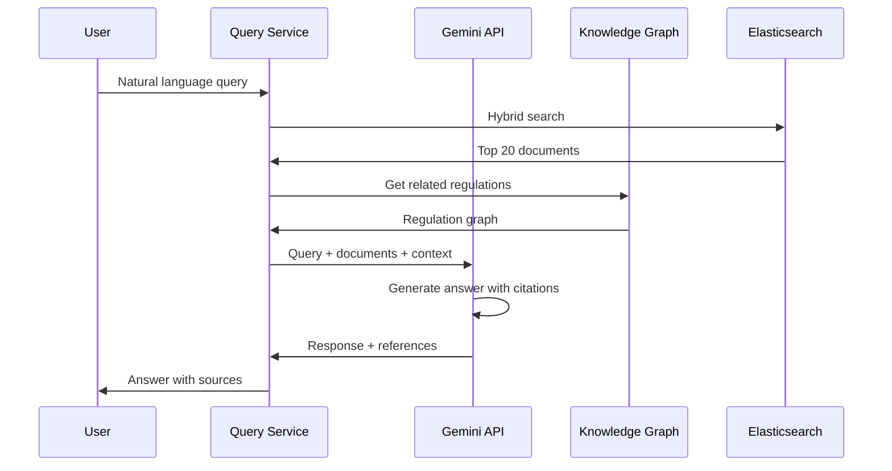

**Gemini API Integration:**

```python
import google.generativeai as genai

class RegulatoryRAG:
    def __init__(self):
        self.model = genai.GenerativeModel('gemini-1.5-pro')
        self.uploaded_files = {}
    
    async def upload_regulations(self, documents: list):
        """Upload regulatory documents to Gemini"""
        for doc in documents:
            file = genai.upload_file(doc.path)
            self.uploaded_files[doc.id] = file
    
    async def answer_query(self, query: str, 
                          relevant_doc_ids: list) -> dict:
        """Answer regulatory question using RAG"""
        
        # Get uploaded files
        files = [self.uploaded_files[doc_id] 
                 for doc_id in relevant_doc_ids 
                 if doc_id in self.uploaded_files]
        
        # Construct prompt
        prompt = f"""
        You are a regulatory compliance assistant for government.
        
        Question: {query}
        
        Instructions:
        1. Find the most relevant regulations from the provided documents
        2. Provide a clear, direct answer
        3. Cite specific sections (e.g., "Section 12(3) of Act X")
        4. Note any ambiguities or conflicting regulations
        5. Use plain language while maintaining legal accuracy
        
        Format your response with:
        - Direct answer (2-3 sentences)
        - Key requirements (bullet points)
        - Legal citations (specific sections)
        - Confidence level (high/medium/low)
        """
        
        # Generate response
        response = self.model.generate_content([prompt, *files])
        
        return {
            'answer': response.text,
            'sources': relevant_doc_ids,
            'model': 'gemini-1.5-pro'
        }
```

### 2.4 Search Architecture

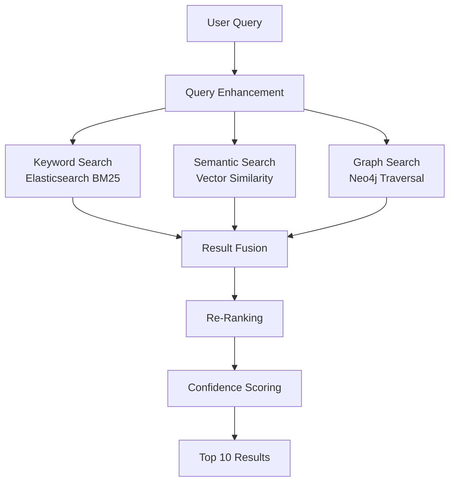

**Hybrid Search Implementation:**

```python
class RegulatorySearch:
    def __init__(self):
        self.es_client = Elasticsearch()
        self.vector_db = PineconeClient()
        self.graph_db = Neo4jClient()
    
    async def search(self, query: str, filters: dict) -> list:
        """Hybrid search across multiple indices"""
        
        # 1. Keyword search
        keyword_results = await self.keyword_search(query, filters)
        
        # 2. Semantic search
        semantic_results = await self.semantic_search(query, filters)
        
        # 3. Graph search for related regulations
        graph_results = await self.graph_search(query, filters)
        
        # 4. Fuse results with weighted scoring
        fused_results = self.fuse_results([
            (keyword_results, 0.4),
            (semantic_results, 0.4),
            (graph_results, 0.2)
        ])
        
        # 5. Re-rank with cross-encoder
        ranked_results = await self.rerank(query, fused_results)
        
        return ranked_results[:10]
    
    async def keyword_search(self, query: str, filters: dict):
        """BM25 keyword search in Elasticsearch"""
        body = {
            'query': {
                'bool': {
                    'must': {'match': {'content': query}},
                    'filter': self.build_filters(filters)
                }
            },
            'size': 50
        }
        return await self.es_client.search(index='regulations', body=body)
```

### 2.5 Compliance Checking Engine

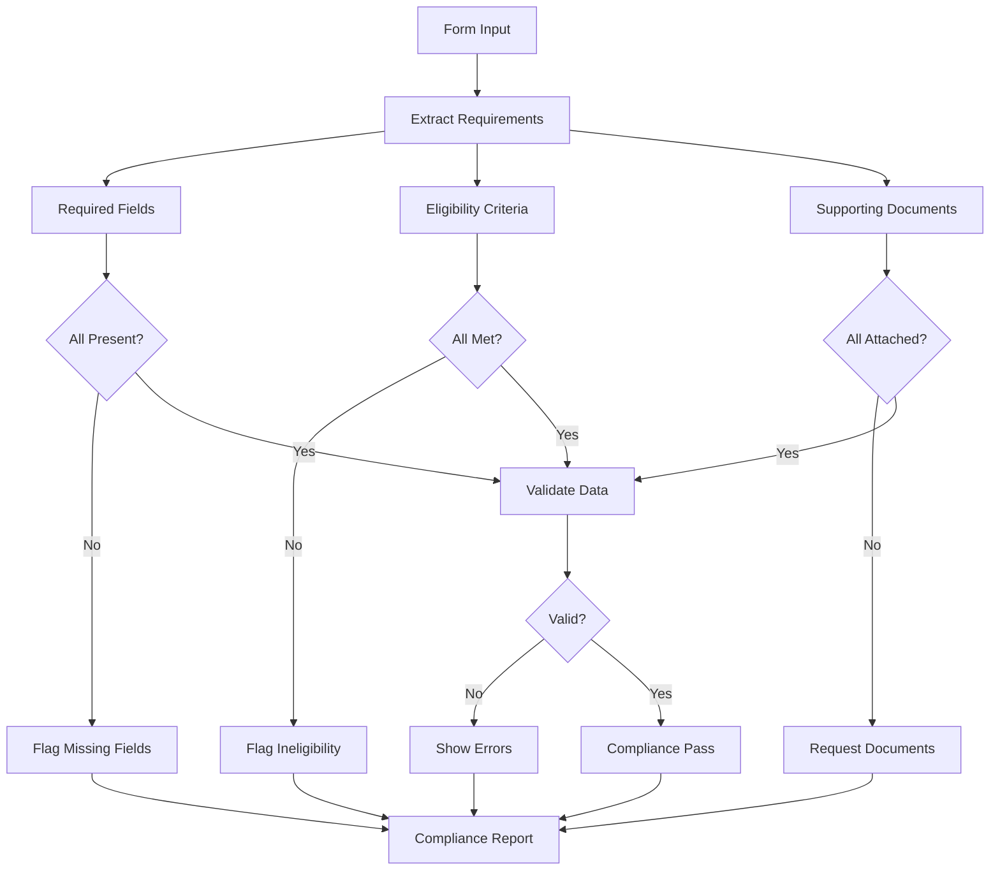

**Compliance Checker:**

```python
class ComplianceChecker:
    def __init__(self):
        self.rule_engine = RuleEngine()
        self.kg_client = Neo4jClient()
    
    async def check_compliance(self, form_data: dict, 
                              program_id: str) -> dict:
        """Check form compliance with regulations"""
        
        # Get applicable regulations
        regulations = await self.get_regulations(program_id)
        
        issues = []
        for regulation in regulations:
            # Extract requirements
            requirements = await self.extract_requirements(regulation)
            
            # Check each requirement
            for req in requirements:
                if not self.check_requirement(form_data, req):
                    issues.append({
                        'requirement': req.description,
                        'regulation': regulation.citation,
                        'severity': req.severity,
                        'suggestion': self.get_suggestion(req)
                    })
        
        return {
            'compliant': len(issues) == 0,
            'issues': issues,
            'confidence': self.calculate_confidence(regulations, issues)
        }
```

## 3. Data Model

### 3.1 Entity-Relationship Diagram

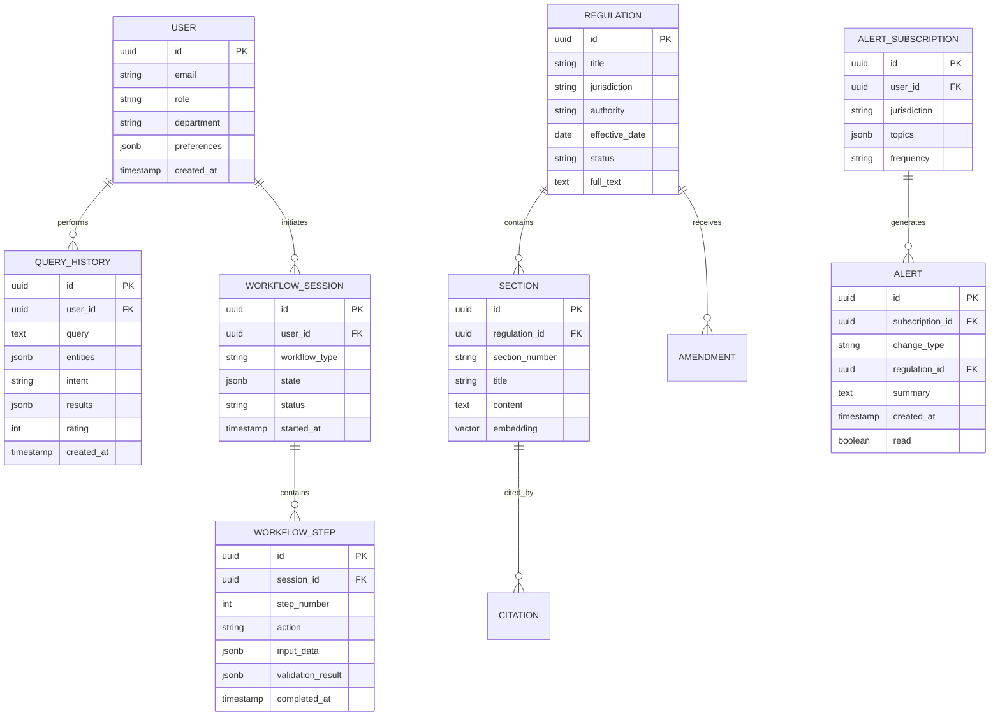

### 3.2 Database Schema

**PostgreSQL Tables:**

```sql
-- Users and access
CREATE TABLE users (
    id UUID PRIMARY KEY DEFAULT gen_random_uuid(),
    email VARCHAR(255) UNIQUE NOT NULL,
    role VARCHAR(50) NOT NULL,
    department VARCHAR(100),
    preferences JSONB DEFAULT '{}',
    created_at TIMESTAMP DEFAULT CURRENT_TIMESTAMP,
    INDEX idx_department (department)
);

-- Regulations
CREATE TABLE regulations (
    id UUID PRIMARY KEY DEFAULT gen_random_uuid(),
    title TEXT NOT NULL,
    jurisdiction VARCHAR(50) NOT NULL,
    authority VARCHAR(255),
    effective_date DATE,
    status VARCHAR(20) DEFAULT 'active',
    full_text TEXT,
    metadata JSONB,
    created_at TIMESTAMP DEFAULT CURRENT_TIMESTAMP,
    updated_at TIMESTAMP DEFAULT CURRENT_TIMESTAMP,
    INDEX idx_jurisdiction (jurisdiction),
    INDEX idx_effective_date (effective_date DESC),
    INDEX idx_status (status)
);

-- Sections (for chunked content)
CREATE TABLE sections (
    id UUID PRIMARY KEY DEFAULT gen_random_uuid(),
    regulation_id UUID REFERENCES regulations(id) ON DELETE CASCADE,
    section_number VARCHAR(50),
    title TEXT,
    content TEXT NOT NULL,
    embedding VECTOR(1536),  -- For vector search
    metadata JSONB,
    INDEX idx_regulation (regulation_id),
    INDEX idx_embedding USING ivfflat (embedding vector_cosine_ops)
);

-- Query history
CREATE TABLE query_history (
    id UUID PRIMARY KEY DEFAULT gen_random_uuid(),
    user_id UUID REFERENCES users(id) ON DELETE CASCADE,
    query TEXT NOT NULL,
    entities JSONB,
    intent VARCHAR(50),
    results JSONB,
    rating INT CHECK (rating >= 1 AND rating <= 5),
    created_at TIMESTAMP DEFAULT CURRENT_TIMESTAMP,
    INDEX idx_user_queries (user_id, created_at DESC),
    INDEX idx_intent (intent)
);

-- Workflow sessions
CREATE TABLE workflow_sessions (
    id UUID PRIMARY KEY DEFAULT gen_random_uuid(),
    user_id UUID REFERENCES users(id),
    workflow_type VARCHAR(100) NOT NULL,
    state JSONB DEFAULT '{}',
    status VARCHAR(20) DEFAULT 'active',
    started_at TIMESTAMP DEFAULT CURRENT_TIMESTAMP,
    completed_at TIMESTAMP,
    INDEX idx_user_workflows (user_id, started_at DESC)
);

-- Alert subscriptions
CREATE TABLE alert_subscriptions (
    id UUID PRIMARY KEY DEFAULT gen_random_uuid(),
    user_id UUID REFERENCES users(id) ON DELETE CASCADE,
    jurisdiction VARCHAR(50),
    topics JSONB DEFAULT '[]',
    frequency VARCHAR(20) DEFAULT 'daily',
    active BOOLEAN DEFAULT true,
    INDEX idx_user_subscriptions (user_id)
);

-- Alerts
CREATE TABLE alerts (
    id UUID PRIMARY KEY DEFAULT gen_random_uuid(),
    subscription_id UUID REFERENCES alert_subscriptions(id),
    change_type VARCHAR(50) NOT NULL,
    regulation_id UUID REFERENCES regulations(id),
    summary TEXT NOT NULL,
    created_at TIMESTAMP DEFAULT CURRENT_TIMESTAMP,
    read BOOLEAN DEFAULT false,
    INDEX idx_subscription (subscription_id, read, created_at DESC)
);
```

**Elasticsearch Index Mapping:**

```json
{
  "mappings": {
    "properties": {
      "regulation_id": {"type": "keyword"},
      "section_id": {"type": "keyword"},
      "title": {"type": "text", "analyzer": "english"},
      "content": {
        "type": "text",
        "analyzer": "legal_analyzer"
      },
      "jurisdiction": {"type": "keyword"},
      "effective_date": {"type": "date"},
      "section_number": {"type": "keyword"},
      "embedding": {
        "type": "dense_vector",
        "dims": 1536,
        "index": true,
        "similarity": "cosine"
      }
    }
  },
  "settings": {
    "analysis": {
      "analyzer": {
        "legal_analyzer": {
          "tokenizer": "standard",
          "filter": ["lowercase", "legal_synonym"]
        }
      }
    }
  }
}
```

## 4. API Design

### 4.1 RESTful API Endpoints

**Search & Query:**
```
POST   /api/v1/search                 - Search regulations
POST   /api/v1/ask                    - Q&A about regulations
GET    /api/v1/regulations/{id}       - Get regulation details
GET    /api/v1/sections/{id}          - Get section details
POST   /api/v1/similar                - Find similar regulations
```

**Compliance:**
```
POST   /api/v1/compliance/check       - Check form compliance
POST   /api/v1/compliance/validate    - Validate specific field
GET    /api/v1/compliance/requirements - Get requirements for program
```

**Workflows:**
```
POST   /api/v1/workflows              - Start guided workflow
GET    /api/v1/workflows/{id}         - Get workflow state
POST   /api/v1/workflows/{id}/step    - Submit workflow step
PUT    /api/v1/workflows/{id}/complete - Complete workflow
```

**Monitoring & Alerts:**
```
POST   /api/v1/subscriptions          - Create alert subscription
GET    /api/v1/subscriptions          - List subscriptions
GET    /api/v1/alerts                 - Get alerts
PUT    /api/v1/alerts/{id}/read       - Mark alert as read
```

**Analytics:**
```
GET    /api/v1/analytics/usage        - Usage statistics
GET    /api/v1/analytics/accuracy     - Accuracy metrics
GET    /api/v1/analytics/feedback     - User feedback summary
```

### 4.2 API Request/Response Examples

**Regulatory Search:**

```json
POST /api/v1/search
{
  "query": "Can a temporary resident apply for employment insurance?",
  "filters": {
    "jurisdiction": ["federal"],
    "programs": ["employment-insurance"]
  },
  "limit": 10
}

Response (200):
{
  "query_id": "uuid",
  "results": [
    {
      "regulation_id": "uuid",
      "title": "Employment Insurance Act",
      "section": "Section 7(1)",
      "content": "Subject to this Part, benefits are payable...",
      "relevance_score": 0.95,
      "confidence": "high",
      "citation": "S.C. 1996, c. 23, s. 7(1)"
    }
  ],
  "total": 15,
  "processing_time_ms": 245
}
```

**Q&A Request:**

```json
POST /api/v1/ask
{
  "question": "What documents do I need to prove residency status?",
  "context": {
    "program": "employment-insurance",
    "user_type": "temporary_resident"
  }
}

Response (200):
{
  "answer": "For temporary residents applying for employment insurance, you need to provide: (1) Your work permit showing you're authorized to work in Canada, (2) Proof of Social Insurance Number (SIN), and (3) Record of Employment from your employer.",
  "confidence": "high",
  "sources": [
    {
      "regulation": "Employment Insurance Act",
      "section": "7(1)",
      "citation": "S.C. 1996, c. 23, s. 7(1)"
    }
  ],
  "related_questions": [
    "How long must I have worked to qualify?",
    "What if my work permit expires soon?"
  ]
}
```

## 5. Guided Workflows

### 5.1 Workflow Engine

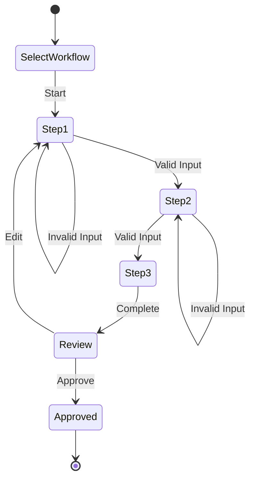

**Workflow Definition:**

```python
class WorkflowEngine:
    def __init__(self):
        self.workflows = self.load_workflows()
    
    async def start_workflow(self, workflow_type: str, 
                            user_id: str) -> dict:
        """Initialize a new workflow session"""
        workflow = self.workflows[workflow_type]
        
        session = {
            'id': str(uuid.uuid4()),
            'user_id': user_id,
            'workflow_type': workflow_type,
            'current_step': 0,
            'state': {},
            'steps': workflow.steps
        }
        
        await self.save_session(session)
        return session
    
    async def process_step(self, session_id: str, 
                          input_data: dict) -> dict:
        """Process a workflow step"""
        session = await self.get_session(session_id)
        current_step = session['steps'][session['current_step']]
        
        # Validate input
        validation = await self.validate_step(current_step, input_data)
        
        if not validation['valid']:
            return {
                'status': 'invalid',
                'errors': validation['errors'],
                'suggestions': validation['suggestions']
            }
        
        # Update state
        session['state'].update(input_data)
        session['current_step'] += 1
        
        # Check if workflow complete
        if session['current_step'] >= len(session['steps']):
            return {'status': 'complete', 'result': session['state']}
        
        # Return next step
        next_step = session['steps'][session['current_step']]
        return {
            'status': 'continue',
            'next_step': next_step,
            'progress': session['current_step'] / len(session['steps'])
        }
```

## 6. Change Monitoring System

### 6.1 Legislative Monitor

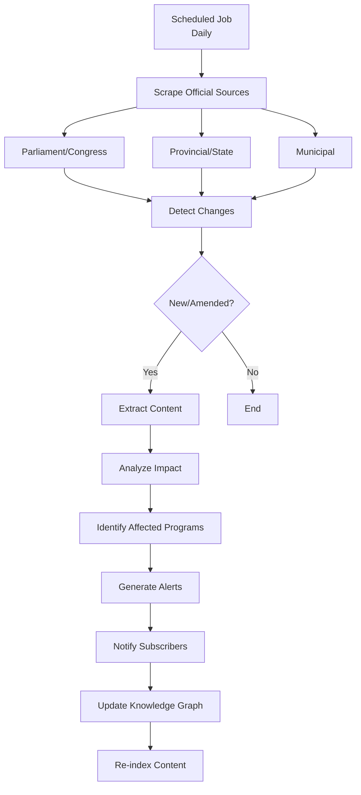

**Change Detection:**

```python
class LegislativeMonitor:
    def __init__(self):
        self.sources = self.load_sources()
        self.last_check = {}
    
    async def monitor_changes(self):
        """Daily check for regulatory changes"""
        changes = []
        
        for source in self.sources:
            # Fetch current content
            current = await self.fetch_source(source)
            
            # Compare with last check
            if source.id in self.last_check:
                diff = self.compare(self.last_check[source.id], current)
                if diff:
                    changes.extend(diff)
            
            # Update last check
            self.last_check[source.id] = current
        
        # Process changes
        for change in changes:
            await self.process_change(change)
        
        return changes
    
    async def process_change(self, change: dict):
        """Process detected regulatory change"""
        # Analyze impact
        impact = await self.analyze_impact(change)
        
        # Generate alert
        alert = {
            'change_type': change.type,
            'regulation_id': change.regulation_id,
            'summary': change.summary,
            'effective_date': change.effective_date,
            'affected_programs': impact.programs,
            'action_required': impact.action_required
        }
        
        # Notify subscribers
        await self.notify_subscribers(alert)
        
        # Update knowledge base
        await self.update_knowledge_base(change)
```

## 7. Security & Compliance

### 7.1 Security Architecture

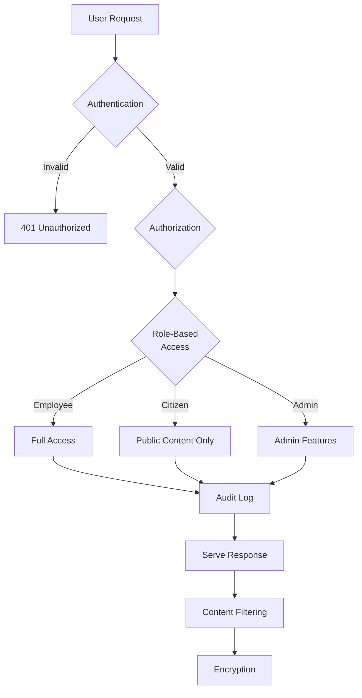

**Security Features:**

1. **Authentication & Authorization:**
   - OAuth 2.0/SAML SSO integration
   - JWT tokens with refresh
   - MFA for administrative access
   - RBAC with department-level permissions

2. **Data Protection:**
   - TLS 1.3 for all connections
   - Encryption at rest (AES-256)
   - No storage of personal case data
   - Anonymized query logging

3. **Audit & Compliance:**
   - Complete audit trail of all queries
   - Regulatory content authenticity verification
   - Regular security audits
   - GDPR/PIPEDA compliance

4. **Content Verification:**
   - Cryptographic signatures on regulations
   - Source verification for all content
   - Version control with git-like tracking
   - Expert validation workflow

## 8. Performance & Scalability

### 8.1 Performance Targets (MVP)

- Search response time: <3 seconds (p95)
- Q&A response time: <5 seconds (p95)
- Page load time: <2 seconds
- Concurrent users: 100+
- Daily queries: 500-1000

### 8.2 Caching Strategy

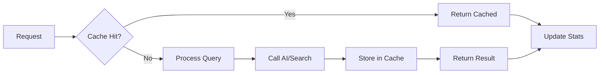

**Cache Layers:**
1. **Redis Cache:**
   - Common queries (1 hour TTL)
   - User sessions (24 hour TTL)
   - Search results (30 min TTL)

2. **Application Cache:**
   - Regulations (until updated)
   - Knowledge graph queries (1 hour)
   - User preferences (session)

## 9. Deployment & DevOps

### 9.1 MVP Deployment Architecture

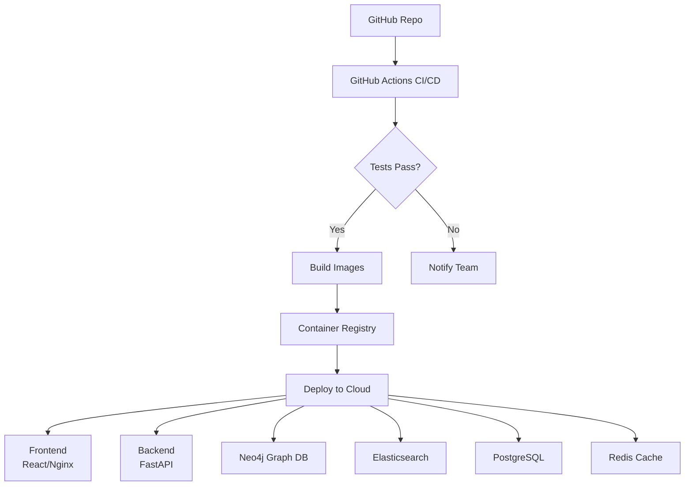

**Docker Compose (MVP):**

```yaml
version: '3.8'
services:
  frontend:
    build: ./frontend
    ports: ["3000:80"]
    depends_on: [backend]
  
  backend:
    build: ./backend
    ports: ["8000:8000"]
    environment:
      - DATABASE_URL=postgresql://db:5432/regulatory
      - NEO4J_URI=bolt://neo4j:7687
      - ELASTICSEARCH_URL=http://elasticsearch:9200
      - REDIS_URL=redis://redis:6379
      - GEMINI_API_KEY=${GEMINI_API_KEY}
    depends_on: [db, neo4j, elasticsearch, redis]
  
  db:
    image: postgres:15-alpine
    environment:
      - POSTGRES_DB=regulatory
      - POSTGRES_PASSWORD=secure_password
    volumes:
      - postgres_data:/var/lib/postgresql/data
    ports: ["5432:5432"]
  
  neo4j:
    image: neo4j:5-community
    environment:
      - NEO4J_AUTH=neo4j/password
    volumes:
      - neo4j_data:/data
    ports: ["7474:7474", "7687:7687"]
  
  elasticsearch:
    image: elasticsearch:8.11.0
    environment:
      - discovery.type=single-node
      - xpack.security.enabled=false
    volumes:
      - es_data:/usr/share/elasticsearch/data
    ports: ["9200:9200"]
  
  redis:
    image: redis:7-alpine
    ports: ["6379:6379"]

volumes:
  postgres_data:
  neo4j_data:
  es_data:
```

## 10. Testing & Validation

### 10.1 Testing Strategy

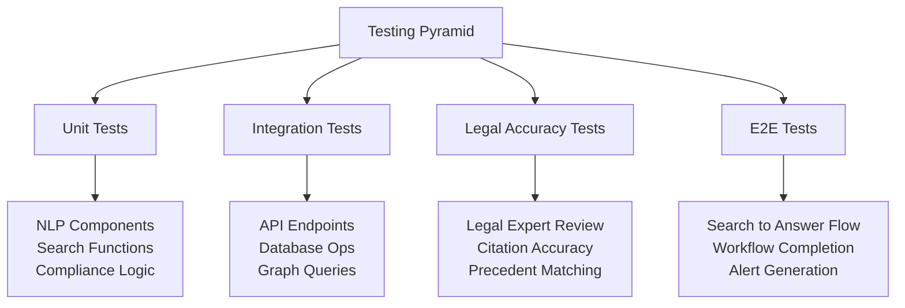

**Testing Approach (2-Week MVP):**

1. **Unit Tests (pytest):**
   - NLP entity extraction
   - Query parsing functions
   - Compliance checking logic
   - Knowledge graph query builders

2. **Integration Tests:**
   - API endpoint functionality
   - Database CRUD operations
   - Neo4j graph operations
   - Elasticsearch indexing and search

3. **Legal Accuracy Tests:**
   - Expert validation of 20-30 test queries
   - Citation accuracy verification
   - Regulation relevance scoring
   - False positive/negative analysis

4. **User Acceptance Tests:**
   - Test with 3-5 caseworkers
   - Measure search accuracy (precision/recall)
   - Evaluate answer quality ratings
   - Track time savings vs manual search

5. **Load Tests:**
   - 50 concurrent users
   - 100 queries per minute
   - Response time monitoring

---

**Document Status:** Complete - MVP Design
