# UI Design Document: Regulatory Intelligence Assistant

**Version:** 1.0  
**Date:** November 24, 2025  
**Framework:** React 18 with TypeScript  
**Status:** Design Phase - Ready for Implementation

---

## Table of Contents
1. [Overview](#overview)
2. [Framework Selection & Rationale](#framework-selection--rationale)
3. [Component Hierarchy](#component-hierarchy)
4. [User Flows](#user-flows)
5. [Wireframes](#wireframes)
6. [Component Specifications](#component-specifications)
7. [State Management Strategy](#state-management-strategy)
8. [Styling Approach](#styling-approach)
9. [Accessibility Considerations](#accessibility-considerations)
10. [Responsive Design Strategy](#responsive-design-strategy)
11. [Implementation Notes](#implementation-notes)

---

## 1. Overview

The Regulatory Intelligence Assistant UI provides an intuitive interface for public servants and citizens to navigate complex regulatory landscapes. The application focuses on three core experiences:

1. **Search & Discovery** - Find relevant regulations quickly through semantic search
2. **Q&A Interface** - Ask questions and get answers with legal citations
3. **Compliance Checking** - Validate forms and applications against regulations

### Design Principles

- **Legal Clarity**: Every answer backed by authoritative sources
- **Progressive Disclosure**: Show simple explanations first, details on demand
- **Confidence Transparency**: Always display confidence levels and uncertainties
- **Accessibility First**: WCAG 2.1 AA compliance minimum
- **Citation-Centric**: Legal references are first-class UI elements

---

## 2. Framework Selection & Rationale

### Selected Stack

**Frontend Framework:** React 18  
**Language:** TypeScript 5.x  
**Styling:** Tailwind CSS 3.x  
**State Management:** Zustand (lightweight, no boilerplate)  
**Routing:** React Router v6  
**UI Components:** shadcn/ui (Radix UI primitives + Tailwind)  
**Form Handling:** React Hook Form + Zod validation  
**Data Fetching:** TanStack Query (React Query)

### Rationale

1. **React 18** - Modern, well-supported, excellent TypeScript integration
2. **TypeScript** - Type safety crucial for legal data structures
3. **Tailwind CSS** - Rapid development, consistent design system
4. **Zustand** - Simpler than Redux, perfect for moderate state complexity
5. **shadcn/ui** - Accessible components, customizable, no runtime overhead
6. **React Hook Form** - Best form performance, minimal re-renders
7. **TanStack Query** - Handles caching, loading states, error handling automatically

### Project Structure

```
frontend/
├── src/
│   ├── components/
│   │   ├── ui/              # shadcn components
│   │   ├── search/          # Search-related components
│   │   ├── chat/            # Q&A chat components
│   │   ├── compliance/      # Compliance checking components
│   │   ├── graph/           # Knowledge graph visualization
│   │   └── shared/          # Shared UI components
│   ├── pages/
│   │   ├── Dashboard.tsx
│   │   ├── Search.tsx
│   │   ├── Chat.tsx
│   │   ├── Compliance.tsx
│   │   ├── Workflows.tsx
│   │   └── RegulationDetail.tsx
│   ├── hooks/               # Custom React hooks
│   ├── store/               # Zustand stores
│   ├── services/            # API client services
│   ├── types/               # TypeScript type definitions
│   ├── utils/               # Helper functions
│   └── App.tsx
├── public/
└── package.json
```

---

## 3. Component Hierarchy

### Application Structure


### Page-Level Component Breakdown


---

## 4. User Flows

### Primary User Journey: Search to Answer


### Compliance Checking Flow


### Guided Workflow Journey


---

## 5. Wireframes

### Dashboard Layout

```mermaid
flowchart TD
    subgraph Dashboard["Dashboard Page Layout"]
        TopBar["Header: Logo | Global Search | Profile"]
        
        subgraph MainContent["Main Content Grid"]
            subgraph LeftCol["Left Column (8 cols)"]
                Stats["Statistics Cards Row"]
                Stats --> SC1["Total Regulations<br/>1,245"]
                Stats --> SC2["Queries Today<br/>89"]
                Stats --> SC3["Avg Response Time<br/>2.1s"]
                
                Chart["Search Activity Chart<br/>(Line chart - last 7 days)"]
                
                Recent["Recent Queries List<br/>- Employment Insurance eligibility<br/>- Temporary resident work permit<br/>- Provincial health coverage"]
            end
            
            subgraph RightCol["Right Column (4 cols)"]
                Quick["Quick Actions"]
                Quick --> QA1["🔍 New Search"]
                Quick --> QA2["💬 Ask Question"]
                Quick --> QA3["✓ Check Compliance"]
                
                Alerts["Regulatory Updates<br/>3 new amendments this week"]
                
                Help["Help & Resources<br/>- Getting Started Guide<br/>- Best Practices<br/>- Contact Support"]
            end
        end
        
        TopBar --> MainContent
    end
    
    style Dashboard fill:#f9fafb
    style LeftCol fill:#ffffff
    style RightCol fill:#f3f4f6
```



### Search Page Layout

```mermaid
flowchart TD
    subgraph SearchPage["Search Page Layout"]
        SearchHeader["Search Bar (Full Width)<br/>Natural language input with autocomplete"]
        
        subgraph ContentArea["Content Area"]
            subgraph LeftSidebar["Filters Sidebar (3 cols)"]
                F1["Jurisdiction<br/>☐ Federal<br/>☐ Provincial<br/>☐ Municipal"]
                F2["Date Range<br/>📅 Effective Date"]
                F3["Document Type<br/>☐ Act<br/>☐ Regulation<br/>☐ Policy"]
                F4["Program<br/>☐ EI<br/>☐ Immigration<br/>☐ Healthcare"]
            end
            
            subgraph Results["Search Results (9 cols)"]
                ResHeader["Found 24 results (0.3s) | Sort by: Relevance ▼"]
                
                R1["Result Card 1<br/>━━━━━━━━━━━━━━<br/>Employment Insurance Act, s. 7(1)<br/>Eligibility requirements for...<br/>🎯 Confidence: High | 📅 Effective: 1996"]
                
                R2["Result Card 2<br/>━━━━━━━━━━━━━━<br/>Immigration and Refugee Protection Act<br/>Work permit requirements for...<br/>🎯 Confidence: High | 📅 Effective: 2002"]
                
                More["... 22 more results<br/>[Load More Button]"]
            end
        end
        
        SearchHeader --> ContentArea
    end
    
    style SearchPage fill:#f9fafb
    style LeftSidebar fill:#f3f4f6
    style Results fill:#ffffff
```



### Chat/Q&A Interface

```mermaid
flowchart TD
    subgraph ChatPage["Q&A Chat Interface"]
        subgraph MainChat["Chat Area (8 cols)"]
            M1["User: Can a temporary resident apply for<br/>employment insurance?"]
            
            M2["Assistant: Yes, temporary residents can apply<br/>for employment insurance if they meet certain<br/>requirements...<br/><br/>📚 Sources:<br/>• Employment Insurance Act, s. 7(1)<br/>• IRPA Regulations, s. 205<br/><br/>🎯 Confidence: High (0.92)"]
            
            M3["User: What documents do they need?"]
            
            Input["━━━━━━━━━━━━━━━━━━━━━━━<br/>Type your question here...<br/>[Send Button]"]
        end
        
        subgraph RightPanel["Citations Panel (4 cols)"]
            CP1["📄 Referenced Regulations<br/>━━━━━━━━━━━━━━━━"]
            CP2["Employment Insurance Act<br/>Section 7(1)<br/>[View Full Text]"]
            CP3["IRPA Regulations<br/>Section 205<br/>[View Full Text]"]
            CP4["━━━━━━━━━━━━━━━━<br/>💡 Related Questions:<br/>- How long must they work?<br/>- What if work permit expires?"]
        end
        
        M1 --> M2
        M2 --> M3
        M3 --> Input
    end
    
    style ChatPage fill:#f9fafb
    style MainChat fill:#ffffff
    style RightPanel fill:#f3f4f6
```



### Compliance Checking Interface

```mermaid
flowchart TD
    subgraph CompliancePage["Compliance Checking Interface"]
        Header["Compliance Check: Employment Insurance Application"]
        
        subgraph FormSection["Form Section (7 cols)"]
            F1["Personal Information<br/>━━━━━━━━━━━━━━━━<br/>Name: [Input] ✓<br/>SIN: [Input] ✓<br/>Residency Status: [Dropdown] ⚠️"]
            
            F2["Employment History<br/>━━━━━━━━━━━━━━━━<br/>Last Employer: [Input] ✓<br/>Hours Worked: [Input] ❌<br/>  ↳ Must be at least 420 hours"]
            
            F3["Supporting Documents<br/>━━━━━━━━━━━━━━━━<br/>☐ Record of Employment<br/>☑ Work Permit<br/>☐ Proof of Residence"]
            
            Submit["[Check Compliance Button]"]
        end
        
        subgraph ValidationPanel["Validation Panel (5 cols)"]
            VP1["⚠️ Compliance Status: Issues Found<br/>━━━━━━━━━━━━━━━━━━━━━"]
            
            VP2["❌ Critical Issues (1)<br/>Hours worked below minimum<br/>Requirement: 420+ hours<br/>Regulation: EI Act s. 7(2)(b)"]
            
            VP3["⚠️ Warnings (1)<br/>Residency status unclear<br/>Suggestion: Provide work permit<br/>Regulation: EI Act s. 7(1)"]
            
            VP4["✓ Passed Checks (12)<br/>Personal info complete<br/>Valid SIN format<br/>..."]
            
            Actions["[Fix Issues] [Export Report]"]
        end
        
        Header --> FormSection
        Header --> ValidationPanel
    end
    
    style CompliancePage fill:#f9fafb
    style FormSection fill:#ffffff
    style ValidationPanel fill:#fff7ed
```



### Regulation Detail Page

```mermaid
flowchart TD
    subgraph RegDetail["Regulation Detail Page"]
        Breadcrumb["Home > Search Results > Employment Insurance Act"]
        
        subgraph Header["Regulation Header"]
            Title["Employment Insurance Act<br/>S.C. 1996, c. 23"]
            Meta["Federal | Effective: Jan 1, 1997 | Last Amended: Jun 2024<br/>🎯 Confidence: Authoritative"]
        end
        
        subgraph Content["Content Area (8 cols)"]
            Tabs["[Summary] [Full Text] [Amendments] [Related]"]
            
            Summary["Summary<br/>━━━━━━━━━━━━━━━━<br/>The Employment Insurance Act provides<br/>income support to eligible workers who...<br/><br/>Key Sections:<br/>• Section 7: Eligibility Requirements<br/>• Section 8: Benefit Period<br/>• Section 12: Disqualifications"]
            
            FullText["Section 7: Eligibility<br/>━━━━━━━━━━━━━━━━<br/>(1) Subject to this Part, benefits are<br/>payable to an insured person who has<br/>accumulated the required number of hours...<br/><br/>(2) The required number of hours of<br/>insurable employment is..."]
        end
        
        subgraph Sidebar["Related Content (4 cols)"]
            Graph["📊 Regulation Network<br/>(Interactive graph visualization)<br/>Shows connections to:<br/>• IRPA<br/>• Provincial Acts<br/>• Related Programs"]
            
            Related["🔗 Related Regulations<br/>• Immigration Act<br/>• Social Insurance Number Regs<br/>• Provincial Employment Standards"]
            
            Actions["💾 Save to Favorites<br/>📧 Share<br/>📥 Export as PDF<br/>⚠️ Subscribe to Updates"]
        end
        
        Breadcrumb --> Header
        Header --> Content
        Header --> Sidebar
    end
    
    style RegDetail fill:#f9fafb
    style Content fill:#ffffff
    style Sidebar fill:#f3f4f6
```



### Regulatory Updates/Change Monitoring Page

```mermaid
flowchart TD
    subgraph UpdatesPage["Regulatory Updates Page"]
        Header["Regulatory Change Monitoring"]
        
        subgraph Filters["Filter Bar (Full Width)"]
            F1["Jurisdiction: [All ▼]"]
            F2["Time Period: [Last 30 Days ▼]"]
            F3["Impact Level: [All ▼]"]
            F4["My Subscriptions Only: ☑"]
        end
        
        subgraph Content["Main Content Area"]
            subgraph Timeline["Change Timeline (8 cols)"]
                T1["📅 November 20, 2025<br/>━━━━━━━━━━━━━━━━<br/>⚠️ HIGH IMPACT<br/>Employment Insurance Act<br/>Amendment to Section 7(2)<br/>New hours requirement: 420 → 450<br/><br/>Affected Programs: 3<br/>Affected Cases: ~150<br/><br/>[View Details] [Impact Assessment]"]
                
                T2["📅 November 15, 2025<br/>━━━━━━━━━━━━━━━━<br/>ℹ️ MEDIUM IMPACT<br/>IRPA Regulations<br/>New work permit category added<br/><br/>Affected Programs: 1<br/><br/>[View Details]"]
                
                More["... older changes<br/>[Load More]"]
            end
            
            subgraph Sidebar["Subscriptions (4 cols)"]
                S1["📬 My Subscriptions<br/>━━━━━━━━━━━━━━━━"]
                S2["• Employment Insurance<br/>  Federal | 12 updates"]
                S3["• Immigration Programs<br/>  Federal | 8 updates"]
                S4["• Tax Benefits<br/>  Federal | 5 updates"]
                S5["<br/>[Manage Subscriptions]"]
                
                Stats["<br/>📊 Update Statistics<br/>━━━━━━━━━━━━━━━━<br/>This Week: 8<br/>This Month: 25<br/>High Impact: 3"]
            end
        end
        
        Header --> Filters
        Filters --> Content
    end
    
    style UpdatesPage fill:#f9fafb
    style Timeline fill:#ffffff
    style Sidebar fill:#f3f4f6
```



### Expert Validation Interface

```mermaid
flowchart TD
    subgraph ExpertPage["Expert Validation Interface"]
        Header["AI Recommendation Review Queue"]
        
        subgraph Queue["Review Queue (5 cols)"]
            Q1["Pending Reviews (12)<br/>━━━━━━━━━━━━━━━━"]
            
            Q2["🔴 High Priority (3)<br/>Complex interpretation needed<br/>[Review]"]
            
            Q3["🟡 Medium Priority (5)<br/>Edge case validation<br/>[Review]"]
            
            Q4["🟢 Low Priority (4)<br/>Standard recommendation<br/>[Review]"]
            
            Stats["<br/>This Month:<br/>✅ Approved: 45<br/>✏️ Modified: 12<br/>❌ Rejected: 3"]
        end
        
        subgraph ReviewPanel["Active Review (7 cols)"]
            Case["Case: EI Eligibility for Part-time Worker<br/>━━━━━━━━━━━━━━━━━━━━━━━━━━━━━━━━━━"]
            
            Query["Original Query:<br/>'Can a part-time worker with 380 hours<br/>qualify for EI benefits?'"]
            
            AI["AI Recommendation:<br/>No - requires 420 hours minimum<br/>Citation: EI Act s. 7(2)(b)<br/>🎯 Confidence: High (0.89)"]
            
            Expert["Expert Review:<br/>☑ Correct interpretation<br/>☐ Partially correct<br/>☐ Incorrect<br/><br/>Additional Notes:<br/>[Text area for comments]<br/><br/>Knowledge Base Article:<br/>☑ Create article from this case"]
            
            Actions["[Approve] [Approve with Notes]<br/>[Request Revision] [Reject]"]
        end
        
        Header --> Queue
        Header --> ReviewPanel
    end
    
    style ExpertPage fill:#f9fafb
    style Queue fill:#f3f4f6
    style ReviewPanel fill:#ffffff
```



### Knowledge Graph Visualization

```mermaid
flowchart TD
    subgraph GraphPage["Knowledge Graph Visualization"]
        Header["Regulation Network: Employment Insurance Act"]
        
        subgraph Controls["Control Panel (3 cols)"]
            C1["View Options<br/>━━━━━━━━━━━━━━━━<br/>Layout: [Force-Directed ▼]<br/>Depth: [2 Levels ▼]<br/>Node Size: [Importance ▼]"]
            
            C2["<br/>Filters<br/>━━━━━━━━━━━━━━━━<br/>☑ References<br/>☑ Amendments<br/>☑ Programs<br/>☐ Conflicts"]
            
            C3["<br/>Legend<br/>━━━━━━━━━━━━━━━━<br/>🔵 Acts<br/>🟢 Sections<br/>🟣 Programs<br/>🔴 Conflicts"]
        end
        
        subgraph GraphViz["Interactive Graph (9 cols)"]
            Central["Central Node:<br/>Employment Insurance Act<br/><br/>Connected to:<br/>• 12 Sections<br/>• 3 Related Acts<br/>• 5 Programs<br/>• 2 Amendments"]
            
            Nav["<br/>[Zoom In] [Zoom Out] [Reset View]<br/>[Export PNG] [Export Data]"]
            
            Info["<br/>Click node to view details<br/>Drag to explore connections<br/>Double-click to focus"]
        end
        
        Header --> Controls
        Header --> GraphViz
    end
    
    style GraphPage fill:#f9fafb
    style Controls fill:#f3f4f6
    style GraphViz fill:#ffffff
```



### Notification Center

```mermaid
flowchart TD
    subgraph NotificationCenter["Notification Center Dropdown"]
        Header["🔔 Notifications (8 unread)"]
        
        Tabs["[All] [Unread] [Updates] [Mentions]"]
        
        subgraph List["Notification List"]
            N1["🔴 NEW<br/>Employment Insurance Act amended<br/>Section 7(2) hours requirement changed<br/>2 hours ago<br/>[View] [Dismiss]"]
            
            N2["🔵 UPDATE<br/>Compliance check result ready<br/>Application #1234<br/>5 hours ago<br/>[View] [Dismiss]"]
            
            N3["📌 @mention<br/>Sarah Chen mentioned you in Expert Review<br/>Case #567<br/>1 day ago<br/>[View] [Dismiss]"]
            
            More["... 5 more notifications<br/>[View All]"]
        end
        
        Footer["[Mark All Read] [Settings]"]
        
        Header --> Tabs
        Tabs --> List
        List --> Footer
    end
    
    style NotificationCenter fill:#ffffff
```



### Settings/Preferences Page

```mermaid
flowchart TD
    subgraph SettingsPage["Settings & Preferences"]
        Nav["Profile | Notifications | Display | Subscriptions | Privacy"]
        
        subgraph Content["Settings Content"]
            Section1["Notification Preferences<br/>━━━━━━━━━━━━━━━━━━━━━━<br/>☑ Email notifications<br/>☑ Browser notifications<br/>☐ SMS notifications (Premium)<br/><br/>Frequency:<br/>○ Real-time<br/>● Daily digest<br/>○ Weekly summary"]
            
            Section2["<br/>Display Settings<br/>━━━━━━━━━━━━━━━━━━━━━━<br/>Theme: [Auto ▼]<br/>Language: [English ▼]<br/>Date Format: [YYYY-MM-DD ▼]<br/>Results per page: [20 ▼]"]
            
            Section3["<br/>Default Filters<br/>━━━━━━━━━━━━━━━━━━━━━━<br/>Jurisdiction: [Federal, Provincial]<br/>My Department: [Employment & Social Dev]<br/>Confidence Threshold: [Medium+]"]
            
            Actions["<br/>[Save Changes] [Reset to Defaults]"]
        end
        
        Nav --> Content
    end
    
    style SettingsPage fill:#f9fafb
    style Content fill:#ffffff
```



---

## 6. Component Specifications

### 6.1 Search Components

#### SearchBar Component

**Purpose:** Primary search input with autocomplete and suggestions

```typescript
interface SearchBarProps {
  placeholder?: string;
  onSearch: (query: string) => void;
  onSuggestionSelect?: (suggestion: Suggestion) => void;
  loading?: boolean;
}

interface Suggestion {
  id: string;
  text: string;
  type: 'regulation' | 'program' | 'query';
  metadata?: Record<string, any>;
}
```

**Features:**
- Real-time autocomplete as user types
- Highlight matching terms in suggestions
- Recent searches dropdown
- Clear button when input has value
- Loading spinner during search

**Styling:**
- Large, prominent search bar (h-12 minimum)
- Shadow on focus for emphasis
- Tailwind classes: `rounded-lg border-2 focus:border-blue-500`

**Accessibility:**
- ARIA label: "Search regulations and policies"
- Autocomplete with ARIA-combobox
- Keyboard navigation (Arrow keys, Enter, Escape)
- Screen reader announcements for result count

---

#### ResultCard Component

**Purpose:** Display individual search result with metadata

```typescript
interface ResultCardProps {
  result: SearchResult;
  onSelect: (id: string) => void;
  highlighted?: boolean;
}

interface SearchResult {
  id: string;
  title: string;
  snippet: string;
  citation: string;
  confidence: number; // 0-1
  relevance_score: number;
  effective_date: string;
  jurisdiction: string;
  document_type: 'act' | 'regulation' | 'policy';
}
```

**Layout:**
```
┌──────────────────────────────────────────┐
│ 🎯 High Confidence (0.92)  📅 1996-01-01 │
│ Employment Insurance Act, s. 7(1)        │
│ ──────────────────────────────────────── │
│ Subject to this Part, benefits are       │
│ payable to an insured person who has     │
│ accumulated the required...              │
│ ──────────────────────────────────────── │
│ Federal • Regulation • [View Full Text]  │
└──────────────────────────────────────────┘
```

**Styling:**
- Card with hover effect (`hover:shadow-md`)
- Confidence badge color-coded (high=green, medium=yellow, low=orange)
- Snippet with highlighted search terms

**Accessibility:**
- Semantic HTML: `<article>` tag
- Clickable card with proper `role="button"`
- Focus ring on keyboard navigation
- Alt text for confidence badge icons

---

#### FilterPanel Component

**Purpose:** Faceted filtering for search results

```typescript
interface FilterPanelProps {
  filters: FilterState;
  onFilterChange: (filters: FilterState) => void;
  resultCount: number;
}

interface FilterState {
  jurisdiction: string[];
  date_range: { start?: string; end?: string };
  document_type: string[];
  programs: string[];
}
```

**Features:**
- Collapsible sections for each filter type
- Checkboxes for multi-select filters
- Date range picker
- "Clear All" button
- Result count updates as filters change

**Accessibility:**
- Fieldset/legend for filter groups
- Clear focus indicators
- Screen reader announcements when filters applied

---

### 6.2 Chat/Q&A Components

#### ChatMessage Component

**Purpose:** Display user or assistant message with citations

```typescript
interface ChatMessageProps {
  message: Message;
  showCitations?: boolean;
}

interface Message {
  id: string;
  role: 'user' | 'assistant';
  content: string;
  citations?: Citation[];
  confidence?: number;
  timestamp: Date;
}

interface Citation {
  regulation_id: string;
  title: string;
  section: string;
  citation_text: string;
}
```

**Layout (Assistant Message):**
```
┌──────────────────────────────────────────┐
│ 🤖 AI Assistant                          │
│ ──────────────────────────────────────── │
│ Yes, temporary residents can apply for   │
│ employment insurance if they meet        │
│ certain requirements. According to       │
│ Section 7(1) of the EI Act [1], ...     │
│                                          │
│ 📚 Sources:                              │
│ [1] Employment Insurance Act, s. 7(1)    │
│ [2] IRPA Regulations, s. 205            │
│                                          │
│ 🎯 Confidence: High (0.92)              │
│ ──────────────────────────────────────── │
│ 12:34 PM                                 │
└──────────────────────────────────────────┘
```

**Styling:**
- User messages: right-aligned, blue background
- Assistant messages: left-aligned, gray background
- Citations as numbered inline links
- Confidence badge at message bottom

**Accessibility:**
- ARIA role="article" for each message
- Time rendered with `<time>` element
- Citation links with descriptive aria-labels

---

#### CitationSidebar Component

**Purpose:** Display all referenced regulations in chat

```typescript
interface CitationSidebarProps {
  citations: Citation[];
  onCitationClick: (id: string) => void;
  activeCitationId?: string;
}
```

**Features:**
- List of all citations from conversation
- Click to view full regulation text
- Highlight active citation
- "Copy citation" button for each
- Link to full regulation detail page

**Styling:**
- Sticky positioning (scrolls with chat)
- Card design with dividers between citations
- Hover effects for interactivity

---

### 6.3 Compliance Components

#### ComplianceForm Component

**Purpose:** Form with real-time validation against regulations

```typescript
interface ComplianceFormProps {
  programId: string;
  onSubmit: (data: FormData) => void;
  onValidate: (field: string, value: any) => ValidationResult;
}

interface ValidationResult {
  valid: boolean;
  errors?: ValidationError[];
  warnings?: ValidationWarning[];
}

interface ValidationError {
  field: string;
  message: string;
  regulation: string; // Citation
  severity: 'critical' | 'high' | 'medium';
}
```

**Features:**
- Field-level validation on blur
- Real-time feedback (<50ms target)
- Tooltips explaining requirements
- Progress indicator showing completion
- Regulation citations for each requirement

**Styling:**
- Error states: red border + error icon
- Warning states: yellow border + warning icon
- Success states: green checkmark
- Disabled state for dependent fields

**Accessibility:**
- ARIA-invalid on error fields
- ARIA-describedby linking to error messages
- Fieldset/legend for logical groupings
- Required field indicators

---

#### ComplianceReport Component

**Purpose:** Display comprehensive compliance check results

```typescript
interface ComplianceReportProps {
  report: ComplianceReport;
  onFixIssue: (issueId: string) => void;
  onExport: () => void;
}

interface ComplianceReport {
  compliant: boolean;
  issues: Issue[];
  passed_checks: string[];
  confidence: number;
  generated_at: Date;
}

interface Issue {
  id: string;
  severity: 'critical' | 'high' | 'medium' | 'low';
  field: string;
  description: string;
  regulation: string;
  suggestion: string;
}
```

**Layout:**
```
┌─────────────────────────────────────┐
│ ⚠️ Compliance Status: Issues Found   │
│ Generated: Nov 24, 2025 1:45 PM     │
│ ───────────────────────────────────  │
│                                     │
│ ❌ CRITICAL ISSUES (2)              │
│ • Hours worked below minimum        │
│   Field: employment_hours           │
│   Required: 420+ hours              │
│   Found: 350 hours                  │
│   Regulation: EI Act s. 7(2)(b)     │
│   [Fix This Issue]                  │
│                                     │
│ ⚠️ WARNINGS (1)                     │
│ • Residency status unclear          │
│   ...                               │
│                                     │
│ ✅ PASSED CHECKS (12)               │
│ • Personal information complete     │
│ • Valid SIN format                  │
│ • ...                               │
│                                     │
│ [Export PDF] [Print] [Email]        │
└─────────────────────────────────────┘
```

**Styling:**
- Color-coded sections (red, yellow, green)
- Expandable/collapsible issue details
- Icons for severity levels
- Clear call-to-action buttons

**Accessibility:**
- Heading hierarchy for screen readers
- Status messages with ARIA-live regions
- Clear focus order through issues

---

### 6.4 Shared UI Components

#### ConfidenceBadge Component

**Purpose:** Display AI confidence level consistently

```typescript
interface ConfidenceBadgeProps {
  score: number; // 0-1
  showLabel?: boolean;
  size?: 'sm' | 'md' | 'lg';
}
```

**Visual Design:**
- High (0.8-1.0): Green badge with "High Confidence"
- Medium (0.5-0.79): Yellow badge with "Medium Confidence"
- Low (0-0.49): Orange badge with "Low Confidence"

**Styling:**
```tsx
<Badge 
  className={cn(
    'inline-flex items-center gap-1',
    score >= 0.8 ? 'bg-green-100 text-green-800' :
    score >= 0.5 ? 'bg-yellow-100 text-yellow-800' :
    'bg-orange-100 text-orange-800'
  )}
>
  <Target className="w-3 h-3" />
  {showLabel && getConfidenceLabel(score)}
</Badge>
```

**Accessibility:**
- ARIA label: "Confidence score: {percentage}"
- Tooltip with explanation on hover

---

#### CitationTag Component

**Purpose:** Inline regulation citation reference

```typescript
interface CitationTagProps {
  citation: string; // e.g., "S.C. 1996, c. 23, s. 7(1)"
  onClick?: () => void;
  variant?: 'default' | 'compact';
}
```

**Styling:**
- Small badge with monospace font
- Clickable with hover underline
- Copy-on-click functionality

---

#### LoadingSpinner Component

**Purpose:** Consistent loading indicator

```typescript
interface LoadingSpinnerProps {
  size?: 'sm' | 'md' | 'lg';
  message?: string;
}
```

**Features:**
- Animated spinner (Tailwind animate-spin)
- Optional loading message below
- Accessible to screen readers

---

## 7. State Management Strategy

### Zustand Store Architecture

```typescript
// store/searchStore.ts
interface SearchState {
  query: string;
  results: SearchResult[];
  filters: FilterState;
  loading: boolean;
  error: string | null;
  
  // Actions
  setQuery: (query: string) => void;
  search: (query: string) => Promise<void>;
  updateFilters: (filters: Partial<FilterState>) => void;
  clearResults: () => void;
}

// store/chatStore.ts
interface ChatState {
  messages: Message[];
  currentQuestion: string;
  loading: boolean;
  
  // Actions
  sendMessage: (content: string) => Promise<void>;
  addMessage: (message: Message) => void;
  clearChat: () => void;
}

// store/complianceStore.ts
interface ComplianceState {
  formData: Record<string, any>;
  validationResults: Record<string, ValidationResult>;
  report: ComplianceReport | null;
  checking: boolean;
  
  // Actions
  updateField: (field: string, value: any) => void;
  validateField: (field: string) => Promise<void>;
  checkCompliance: () => Promise<void>;
}

// store/userStore.ts
interface UserState {
  user: User | null;
  preferences: UserPreferences;
  recentSearches: string[];
  savedRegulations: string[];
  
  // Actions
  setUser: (user: User) => void;
  updatePreferences: (prefs: Partial<UserPreferences>) => void;
  addRecentSearch: (query: string) => void;
  toggleSavedRegulation: (id: string) => void;
}
```

### Store Usage Pattern

**Components should access stores directly** (no prop drilling):

```typescript
// ❌ Bad: Prop drilling
function SearchPage({ query, onSearch, results }: Props) {
  return <SearchBar query={query} onSearch={onSearch} />
}

// ✅ Good: Direct store access
function SearchPage() {
  const { query, search, results } = useSearchStore();
  return <SearchBar />
}

function SearchBar() {
  const { query, setQuery, search } = useSearchStore();
  return (
    <input 
      value={query} 
      onChange={(e) => setQuery(e.target.value)}
      onKeyDown={(e) => e.key === 'Enter' && search()}
    />
  );
}
```

### Data Fetching with TanStack Query

```typescript
// hooks/useRegulation.ts
import { useQuery } from '@tanstack/react-query';
import { api } from '@/services/api';

export function useRegulation(id: string) {
  return useQuery({
    queryKey: ['regulation', id],
    queryFn: () => api.getRegulation(id),
    staleTime: 5 * 60 * 1000, // 5 minutes
    gcTime: 10 * 60 * 1000, // 10 minutes
  });
}

// Usage in component
function RegulationDetail({ id }: Props) {
  const { data, isLoading, error } = useRegulation(id);
  
  if (isLoading) return <LoadingSpinner />;
  if (error) return <ErrorMessage error={error} />;
  
  return <RegulationContent regulation={data} />;
}
```

---

## 8. Styling Approach

### Tailwind CSS Configuration

**Primary Color Palette:**
- Blue (Primary): `#2563eb` - Trust, authority, government
- Green (Success): `#16a34a` - High confidence, passed checks
- Yellow (Warning): `#eab308` - Medium confidence, warnings
- Red (Error): `#dc2626` - Low confidence, critical issues
- Gray (Neutral): `#6b7280` - Text, borders, backgrounds

**Tailwind Config (`tailwind.config.js`):**

```javascript
module.exports = {
  content: ['./src/**/*.{ts,tsx}'],
  theme: {
    extend: {
      colors: {
        primary: {
          50: '#eff6ff',
          100: '#dbeafe',
          500: '#2563eb',
          600: '#1d4ed8',
          700: '#1e40af',
        },
        confidence: {
          high: '#16a34a',
          medium: '#eab308',
          low: '#dc2626',
        },
      },
      fontFamily: {
        sans: ['Inter', 'system-ui', 'sans-serif'],
        mono: ['JetBrains Mono', 'monospace'],
      },
      fontSize: {
        'citation': ['0.875rem', { lineHeight: '1.25rem', letterSpacing: '-0.01em' }],
      },
    },
  },
  plugins: [
    require('@tailwindcss/forms'),
    require('@tailwindcss/typography'),
  ],
};
```

### shadcn/ui Components

**Install Required Components:**

```bash
npx shadcn-ui@latest add button
npx shadcn-ui@latest add card
npx shadcn-ui@latest add input
npx shadcn-ui@latest add badge
npx shadcn-ui@latest add dialog
npx shadcn-ui@latest add tabs
npx shadcn-ui@latest add accordion
npx shadcn-ui@latest add tooltip
npx shadcn-ui@latest add separator
npx shadcn-ui@latest add skeleton
npx shadcn-ui@latest add alert
npx shadcn-ui@latest add scroll-area
```

### Component Styling Guidelines

**1. Citation Components:**
- Monospace font for legal references
- Subtle background color (#f3f4f6)
- Copy-on-click with tooltip feedback

**2. Confidence Badges:**
- Color-coded by score (green/yellow/orange)
- Rounded pill shape
- Target icon prefix

**3. Search Results:**
- Card design with hover elevation
- Snippet text with highlighted terms
- Clear visual hierarchy (title > snippet > metadata)

**4. Forms:**
- Clear error states with red borders
- Success states with green checkmarks
- Warning states with yellow borders
- Inline validation messages

**5. Loading States:**
- Skeleton screens for content placeholders
- Spinner for actions
- Progress bars for multi-step workflows

---

## 9. Accessibility Considerations

### WCAG 2.1 AA Compliance

**Color Contrast:**
- Text: Minimum 4.5:1 ratio
- UI Components: Minimum 3:1 ratio
- Confidence badges meet contrast requirements

**Keyboard Navigation:**
- All interactive elements keyboard accessible
- Logical tab order throughout application
- Skip links for main content areas
- Focus trap in modals/dialogs

**Screen Reader Support:**
- Semantic HTML throughout (`<article>`, `<nav>`, `<main>`)
- ARIA labels for icons and buttons
- ARIA-live regions for dynamic content
- ARIA-describedby for form validation

**Focus Management:**
- Visible focus indicators (2px outline)
- Focus restoration after modal close
- Preserve focus in search results navigation

### Accessibility Features by Component

**SearchBar:**
```tsx
<div role="combobox" aria-expanded={showSuggestions}>
  <input
    aria-label="Search regulations and policies"
    aria-autocomplete="list"
    aria-controls="suggestions-list"
  />
  <div id="suggestions-list" role="listbox">
    {suggestions.map(s => (
      <div role="option" aria-selected={selected === s.id}>
        {s.text}
      </div>
    ))}
  </div>
</div>
```

**ComplianceForm:**
```tsx
<input
  aria-invalid={!!error}
  aria-describedby={error ? `${id}-error` : undefined}
  aria-required={required}
/>
{error && (
  <p id={`${id}-error`} role="alert">
    {error.message}
  </p>
)}
```

**ChatMessage:**
```tsx
<article 
  role="article" 
  aria-label={`Message from ${role === 'user' ? 'you' : 'assistant'}`}
>
  <div aria-live="polite" aria-atomic="true">
    {content}
  </div>
  <time dateTime={timestamp.toISOString()}>
    {formatTime(timestamp)}
  </time>
</article>
```

---

## 10. Responsive Design Strategy

### Breakpoint System

```typescript
// Tailwind breakpoints (mobile-first)
const breakpoints = {
  sm: '640px',   // Small tablets
  md: '768px',   // Tablets
  lg: '1024px',  // Laptops
  xl: '1280px',  // Desktops
  '2xl': '1536px', // Large desktops
};
```

### Layout Adaptations

**Dashboard Page:**
- **Mobile (<640px):** Single column, stacked cards
- **Tablet (640-1024px):** 2-column grid for stats
- **Desktop (>1024px):** 3-column layout with sidebar

**Search Page:**
- **Mobile:** Filters in bottom sheet, full-width results
- **Tablet:** Collapsible filter sidebar
- **Desktop:** Fixed filter sidebar (3 cols), results (9 cols)

**Chat Page:**
- **Mobile:** Full-width chat, citations in expandable sheet
- **Tablet:** 70/30 split (chat/citations)
- **Desktop:** 66/33 split with fixed citation panel

**Compliance Page:**
- **Mobile:** Single column, report below form
- **Tablet:** Single column with side-by-side sections
- **Desktop:** 60/40 split (form/validation panel)

### Mobile-Specific Considerations

**Touch Targets:**
- Minimum 44x44px tap targets
- Adequate spacing between interactive elements
- Swipe gestures for navigation (optional)

**Mobile Navigation:**
- Bottom navigation bar for primary actions
- Hamburger menu for secondary navigation
- Floating action button for quick search

**Performance:**
- Lazy load images and heavy components
- Optimize bundle size (<500KB initial load)
- Prefetch critical resources

**Responsive Images:**
```tsx

```

---

## 11. Implementation Notes

### Development Workflow

**Phase 1: Setup (Week 1, Days 1-2)**
1. Initialize React project with TypeScript
2. Install dependencies (Tailwind, shadcn/ui, Zustand, React Router, TanStack Query)
3. Configure Tailwind with custom theme
4. Set up folder structure
5. Install shadcn/ui components
6. Create base layout components

**Phase 2: Core Pages (Week 1, Days 3-5)**
1. Implement Dashboard page with mock data
2. Build Search page with filter panel
3. Create Chat/Q&A interface
4. Develop Compliance checking form
5. Connect to backend APIs

**Phase 3: Polish & Testing (Week 2, Days 1-3)**
1. Responsive design refinements
2. Accessibility audit with axe DevTools
3. Performance optimization
4. Cross-browser testing
5. User acceptance testing

### API Integration

**Base API Client:**

```typescript
// services/api.ts
import axios from 'axios';

const api = axios.create({
  baseURL: process.env.REACT_APP_API_URL || 'http://localhost:8000/api/v1',
  timeout: 10000,
  headers: {
    'Content-Type': 'application/json',
  },
});

// Search
export const search = async (query: string, filters: FilterState) => {
  const { data } = await api.post('/search', { query, ...filters });
  return data;
};

// Q&A
export const askQuestion = async (question: string, context?: any) => {
  const { data } = await api.post('/ask', { question, context });
  return data;
};

// Compliance
export const checkCompliance = async (formData: any, programId: string) => {
  const { data } = await api.post('/compliance/check', { 
    form_data: formData,
    program_id: programId 
  });
  return data;
};

export default api;
```

### Environment Variables

```bash
# .env.local
REACT_APP_API_URL=http://localhost:8000/api
REACT_APP_ENABLE_ANALYTICS=false
REACT_APP_ENVIRONMENT=development
```

### Performance Targets

- **Initial Load:** <2 seconds (3G network)
- **Search Results:** <3 seconds (p95)
- **Q&A Response:** <5 seconds (p95)
- **Compliance Check:** <3 seconds (p95)
- **Lighthouse Score:** >90 for all categories

### Testing Strategy

**Unit Tests (Jest + React Testing Library):**
```typescript
// __tests__/SearchBar.test.tsx
import { render, screen, fireEvent } from '@testing-library/react';
import { SearchBar } from '@/components/search/SearchBar';

describe('SearchBar', () => {
  it('calls onSearch when Enter pressed', () => {
    const onSearch = jest.fn();
    render(<SearchBar onSearch={onSearch} />);
    
    const input = screen.getByRole('combobox');
    fireEvent.change(input, { target: { value: 'employment insurance' } });
    fireEvent.keyDown(input, { key: 'Enter' });
    
    expect(onSearch).toHaveBeenCalledWith('employment insurance');
  });
});
```

**Accessibility Tests:**
```typescript
import { axe, toHaveNoViolations } from 'jest-axe';

expect.extend(toHaveNoViolations);

it('has no accessibility violations', async () => {
  const { container } = render(<SearchBar />);
  const results = await axe(container);
  expect(results).toHaveNoViolations();
});
```

### Component File Size Limits

All components MUST stay under 300 lines. If a component exceeds this:

1. **Extract subcomponents:** Break into smaller, focused components
2. **Extract hooks:** Move complex logic to custom hooks
3. **Extract styles:** Use separate style modules if needed
4. **Extract constants:** Move to separate config files

### Code Quality Standards

**TypeScript:**
- Strict mode enabled
- No `any` types (use `unknown` and type guards)
- Interface over type for object shapes
- Explicit return types for functions

**React:**
- Functional components only
- Custom hooks for reusable logic
- Memoize expensive computations
- Avoid prop drilling (use Zustand)

**Naming Conventions:**
- Components: PascalCase (`SearchBar.tsx`)
- Hooks: camelCase with `use` prefix (`useSearch.ts`)
- Utils: camelCase (`formatCitation.ts`)
- Constants: UPPER_SNAKE_CASE

---

## Appendix: Component Library Reference

### shadcn/ui Components to Use

| Component | Use Case |
|-----------|----------|
| Button | Primary actions, links |
| Card | Result cards, regulation details |
| Input | Search bars, form fields |
| Badge | Confidence levels, tags |
| Dialog | Modals, confirmations |
| Tabs | Navigation between views |
| Accordion | Collapsible filters, FAQs |
| Tooltip | Explanations, help text |
| Separator | Visual dividers |
| Skeleton | Loading placeholders |
| Alert | Important messages |
| ScrollArea | Long content areas |
| Select | Dropdowns, filters |
| Checkbox | Multi-select filters |
| RadioGroup | Single-select options |
| Label | Form field labels |
| Form | Form wrapper with validation |
| Table | Structured data display |

### Custom Components to Build

1. **SearchBar** - Autocomplete search input
2. **ResultCard** - Search result display
3. **ChatMessage** - User/assistant messages
4. **CitationTag** - Inline regulation reference
5. **ConfidenceBadge** - AI confidence indicator
6. **ComplianceReport** - Compliance check results
7. **RegulationViewer** - Full regulation display
8. **KnowledgeGraph** - Interactive graph visualization
9. **WorkflowStepper** - Guided workflow progress
10. **FilterPanel** - Faceted search filters

---

**Document Status:** Complete - Ready for Implementation  
**Last Updated:** November 24, 2025
