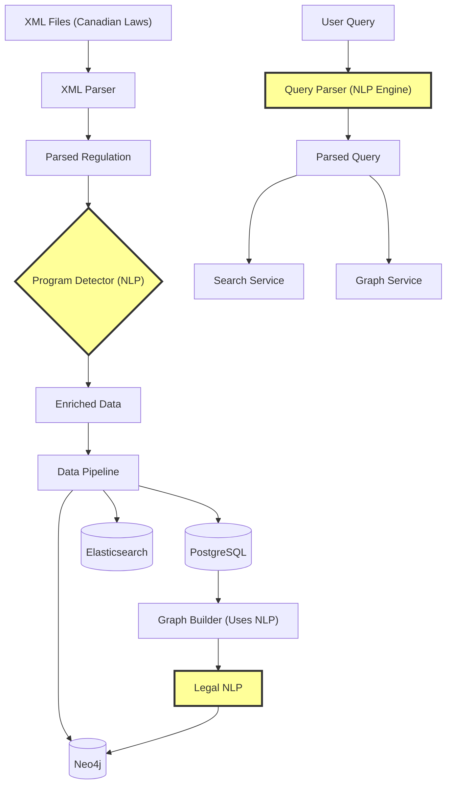
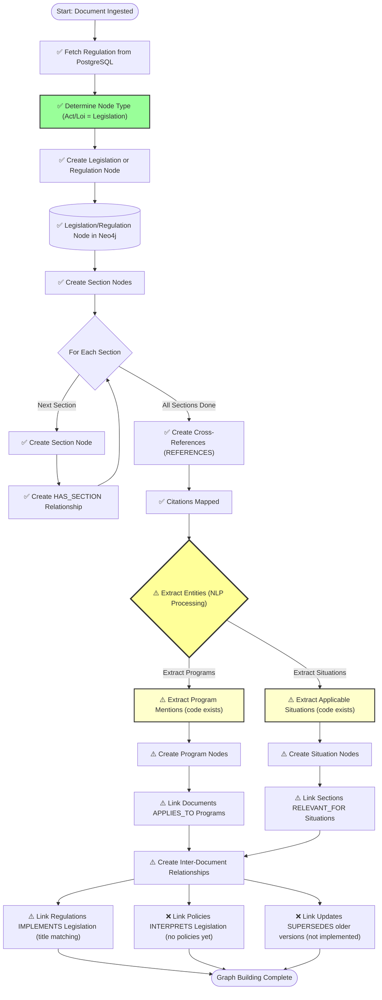
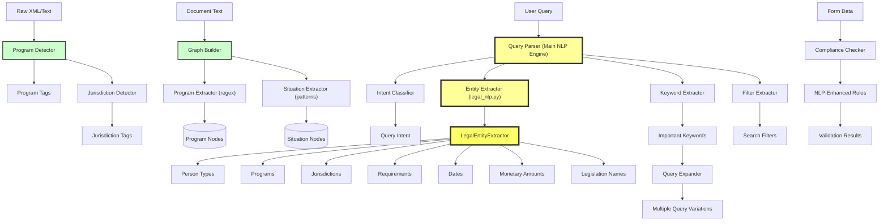
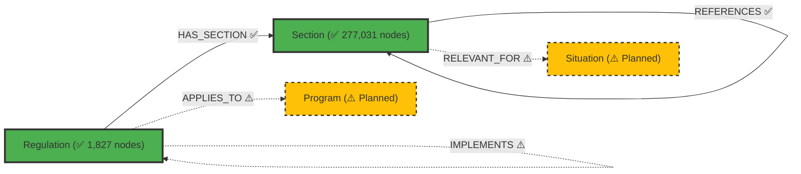
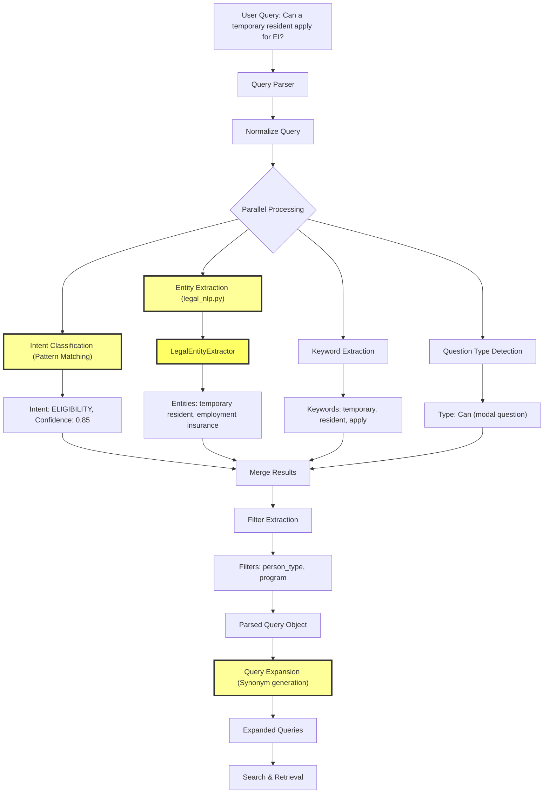
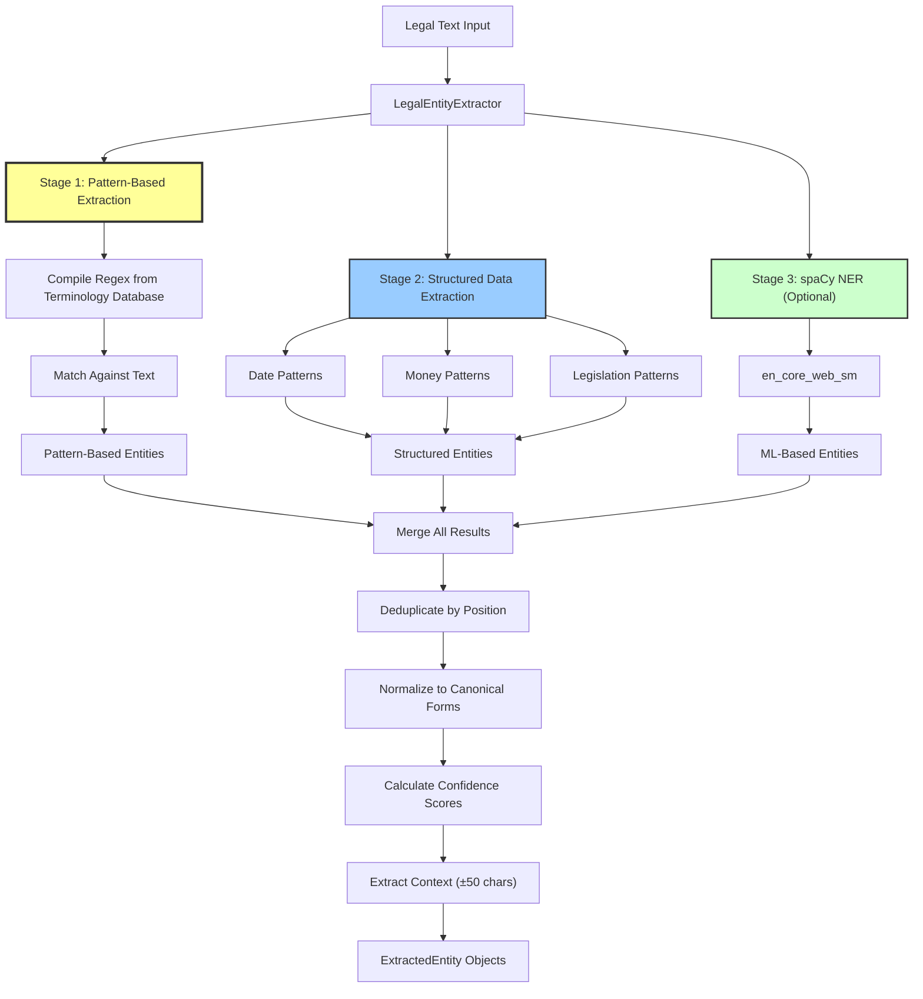
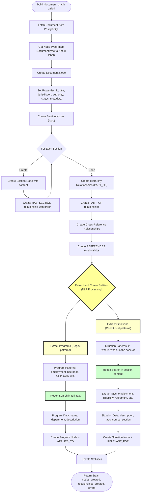
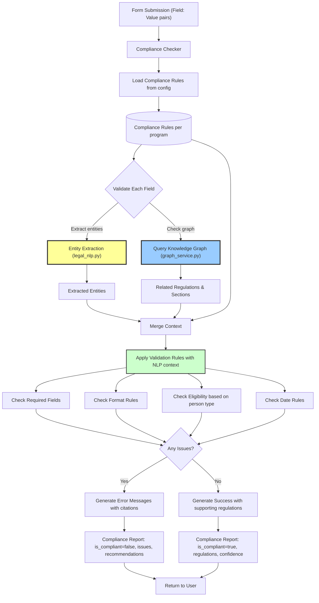

# Knowledge Graph & NLP Architecture

**Regulatory Intelligence Assistant - Graph Builder & NLP Integration**

This document provides comprehensive visual diagrams showing how our knowledge graph is created and where Natural Language Processing (NLP) is integrated throughout the system.

**✅ Implementation Status (Updated Dec 2024):**
- **Node Types**: Legislation (Acts/Lois) and Regulation nodes are now distinguished by title parsing
- **Relationships**: HAS_SECTION, REFERENCES, APPLIES_TO, RELEVANT_FOR implemented; IMPLEMENTS partially implemented
- **Entity Extraction**: Program and Situation extraction code exists (needs testing with real data)
- **Inter-Document**: Links regulations to legislation based on title mentions
- **NOT YET**: Policy nodes, INTERPRETS, SUPERSEDES relationships

---

## Table of Contents

1. [Overall Data Processing Pipeline](#1-overall-data-processing-pipeline)
2. [Knowledge Graph Creation Flow](#2-knowledge-graph-creation-flow)
3. [NLP Integration Points](#3-nlp-integration-points)
4. [Graph Entity Relationships](#4-graph-entity-relationships)
5. [Query Processing with NLP](#5-query-processing-with-nlp)
6. [Entity Extraction Pipeline](#6-entity-extraction-pipeline)
7. [Graph Builder Internal Flow](#7-graph-builder-internal-flow)
8. [Compliance Checking with Graph & NLP](#8-compliance-checking-with-graph--nlp)

---

## 1. Overall Data Processing Pipeline

This diagram shows the complete data ingestion pipeline from raw XML files to all storage systems, highlighting where NLP is applied.



**Key NLP Integration Points:**
1. **Program Detection**: Identifies government programs from text
2. **Entity Extraction**: Extracts legal entities during graph building
3. **Query Understanding**: Parses user queries for intent and entities

---

## 2. Knowledge Graph Creation Flow

This diagram shows the step-by-step process of how the knowledge graph is built from parsed documents.

**✅ = Implemented | ⚠️ = Partially Implemented | ❌ = Not Implemented**



**Graph Building Steps:**
1. **✅ Document Node Creation**: Creates Legislation node (for Acts/Lois) or Regulation node based on title
2. **✅ Section Nodes**: All sections with content and metadata
3. **❌ Hierarchy Creation**: PART_OF relationships removed (parent_section_id doesn't exist)
4. **✅ Cross-References**: Citation links via REFERENCES relationships
5. **⚠️ Entity Extraction (NLP)**: Code exists for Programs and Situations (needs data to trigger)
6. **⚠️ Inter-Document Links**: IMPLEMENTS implemented for Regulations→Legislation; INTERPRETS/SUPERSEDES not yet

---

## 3. NLP Integration Points

This diagram highlights all the places where NLP is used throughout the system.



**NLP Components:**

1. **Program Detector**: Identifies government programs from text
2. **Entity Extractor**: Extracts legal entities (programs, person types, jurisdictions)
3. **Query Parser**: Main NLP engine for query understanding
4. **Intent Classifier**: Determines user intent (search, compliance, eligibility)
5. **Query Expander**: Generates synonym variations for better search

---

## 4. Graph Entity Relationships

This diagram shows all the node types and relationship types in the knowledge graph.

**CURRENT IMPLEMENTATION STATUS:**

✅ **Implemented and Active:**
- Node Types: `Regulation`, `Section`
- Relationships: `HAS_SECTION`, `PART_OF`, `REFERENCES`

⚠️ **Code Exists But Not Creating Data:**
- Node Types: `Program`, `Situation`
- Relationships: `APPLIES_TO`, `RELEVANT_FOR`, `IMPLEMENTS`, `INTERPRETS`, `SUPERSEDES`



**Node Types:**

| Node | Description | Status | Count | Database Table |
|------|-------------|--------|-------|----------------|
| **Regulation** | Acts, laws, regulations | ✅ Active | 1,827 | `regulations` |
| **Section** | Content segments | ✅ Active | 277,031 | `sections` |
| **Program** | Government programs | ⚠️ Planned | 0 | N/A |
| **Situation** | Applicable scenarios | ⚠️ Planned | 0 | N/A |

**Relationship Types:**

| Relationship | From → To | Description | Status | Count |
|--------------|-----------|-------------|--------|-------|
| **HAS_SECTION** | Regulation → Section | Document structure | ✅ Active | 277,027 |
| **PART_OF** | Section → Section | Hierarchy | ✅ Active | 164,722 |
| **REFERENCES** | Section → Section | Citations | ✅ Active | 28,604 |
| **IMPLEMENTS** | Regulation → Regulation | Implementing relationship | ⚠️ Planned | 0 |
| **APPLIES_TO** | Regulation → Program | Program applicability | ⚠️ Planned | 0 |
| **RELEVANT_FOR** | Section → Situation | Scenario relevance | ⚠️ Planned | 0 |
| **INTERPRETS** | Regulation → Regulation | Interpretation | ⚠️ Planned | 0 |
| **SUPERSEDES** | Regulation → Regulation | Version updates | ⚠️ Planned | 0 |

**Note:** The system currently uses a single `Regulation` node type for all regulatory documents (legislation, regulations, policies). The original design had separate node types (`Legislation`, `Policy`) but the implementation consolidated them.

---

## 5. Query Processing with NLP

This diagram shows how user queries are processed using NLP to extract structured information.



**Query Processing Steps:**

1. **Normalization**: Clean and standardize text
2. **Intent Classification**: Determine what user wants (search, compliance, eligibility)
3. **Entity Extraction**: Find legal entities using patterns and NLP
4. **Keyword Extraction**: Extract important terms
5. **Filter Extraction**: Convert entities to search filters
6. **Query Expansion**: Generate synonyms for better recall

---

## 6. Entity Extraction Pipeline

This diagram shows the detailed NLP process for extracting legal entities from text.



**Entity Extraction Methods:**

1. **Pattern-Based**: Regex patterns from legal terminology database (highest confidence)
2. **Structured Data**: Specialized regex for dates, money, legislation names
3. **spaCy NER**: Machine learning model for additional entity types (optional)
4. **Canonicalization**: Normalize to standard forms (e.g., "EI" → "employment_insurance")
5. **Confidence Scoring**: Based on match quality and method

**Confidence Scores:**
- Exact canonical match: **0.95**
- Known synonym: **0.85**
- Pattern match: **0.75**
- spaCy entity: **0.80**
- Structured data (date/money): **0.90-0.95**

---

## 7. Graph Builder Internal Flow

This diagram shows the internal methods and data flow within the GraphBuilder service.



**Key Methods:**

| Method | Purpose | NLP Used |
|--------|---------|----------|
| `build_document_graph` | Main entry point | Orchestrates |
| `_create_document_node` | Create top-level node | ❌ |
| `_create_section_nodes` | Create all sections | ❌ |
| `_create_hierarchy_relationships` | PART_OF links | ❌ |
| `_create_cross_reference_relationships` | REFERENCES links | ❌ |
| `_extract_programs` | Find program mentions | ✅ Regex patterns |
| `_extract_situations` | Find applicable scenarios | ✅ Conditional patterns |
| `_extract_tags` | Categorize situations | ✅ Keyword matching |
| `_create_program_node` | Create Program node | ❌ |
| `_create_situation_node` | Create Situation node | ❌ |

**Program Extraction Patterns:**
```regex
(?i)(employment\s+insurance)\s+(program|benefits?)
(?i)(old\s+age\s+security)\s+(program|benefits?)
(?i)(canada\s+pension\s+plan)\s+(benefits?|program)?
(?i)(workers['']?\s+compensation)\s+(program|benefits?)
```

**Situation Extraction Patterns:**
```regex
(?i)if\s+(?:you|a\s+person|an\s+individual)\s+(?:is|are|has|have)\s+([^.]{10,100})
(?i)where\s+(?:a|an|the)\s+([^.]{10,100})
(?i)in\s+the\s+case\s+of\s+([^.]{10,100})
(?i)when\s+(?:a|an|the)\s+([^.]{10,100})
```

---

## 8. Compliance Checking with Graph & NLP

This diagram shows how compliance checking leverages both the knowledge graph and NLP.



**Compliance Checking Process:**

1. **Load Rules**: Program-specific validation rules
2. **Extract Entities**: Use NLP to identify person types, requirements, programs
3. **Query Graph**: Find relevant regulations and sections
4. **Merge Context**: Combine rules, entities, and graph data
5. **Apply Validations**: Check required fields, formats, eligibility, dates
6. **Generate Report**: Create detailed compliance report with citations

**Example Flow:**

```
User Query: "Check EI application for temporary resident"
↓
NLP Extraction:
  - person_type: "temporary_resident"
  - program: "employment_insurance"
↓
Graph Query:
  - Find EI regulations
  - Find sections about eligibility
  - Find temporary resident requirements
↓
Validation:
  - Required fields present?
  - Valid SIN format?
  - Is temporary resident eligible for EI? (Check graph)
↓
Result:
  ✓ Valid SIN format
  ✓ All required fields present
  ✗ Temporary residents not eligible for EI
     Citation: EI Act Section 7(1)(a) - must be "insured person"
```

---

## Summary: Where NLP is Used

| Component | NLP Technology | Purpose |
|-----------|---------------|---------|
| **Program Detector** | Regex + Keywords | Detect government programs from text |
| **Graph Builder** | Regex patterns | Extract programs and situations during graph creation |
| **Legal Entity Extractor** | Regex + spaCy (optional) | Extract person types, programs, jurisdictions, requirements |
| **Query Parser** | Pattern matching + Entity extraction | Understand user intent and extract entities |
| **Intent Classifier** | Pattern matching | Classify query intent (search, compliance, eligibility) |
| **Query Expander** | Synonym generation | Create query variations for better search |
| **Compliance Checker** | Entity extraction | Extract entities from form data for validation |

---

## Technology Stack

### NLP Components
- **Pattern-Based**: Regex patterns for legal terminology (primary method)
- **spaCy**: Optional ML-based NER (for organizations, dates, money)
- **Custom Extractors**: Specialized for legal/regulatory text

### Knowledge Graph
- **Neo4j**: Graph database for storing entities and relationships
- **Cypher**: Query language for graph traversal

### Search
- **Elasticsearch**: Full-text search with metadata filtering
- **Hybrid Search**: Keyword + semantic search

### Embeddings & RAG
- **Gemini API**: Vector embeddings for semantic search
- **Retrieval-Augmented Generation**: Context-aware answers

---

## Key Design Principles

1. **Legal Accuracy**: All NLP must preserve legal meaning and context
2. **Verifiable Citations**: Every extracted entity linked to source text
3. **Confidence Scoring**: All NLP outputs include confidence scores
4. **Human Review**: High-stakes decisions require expert validation
5. **Explainability**: Clear reasoning for all NLP decisions
6. **Multi-System**: Graph, search, and relational DB work together
7. **Incremental Processing**: Build graph as documents are ingested

---

## Performance Characteristics

| Operation | Time | NLP Overhead |
|-----------|------|--------------|
| **Graph Build** (per document) | 1-5 seconds | ~20% (entity extraction) |
| **Entity Extraction** | 50-200ms | 100% (NLP operation) |
| **Query Parsing** | 10-50ms | 100% (NLP operation) |
| **Graph Traversal** | <100ms | 0% (pure graph query) |
| **Compliance Check** | 100-500ms | ~30% (entity extraction) |

---

## Future Enhancements

1. **Fine-tuned Legal LLM**: Domain-specific language model for Canadian law
2. **Graph Neural Networks**: ML on knowledge graph for better recommendations
3. **Active Learning**: Improve entity extraction from user feedback
4. **Cross-Reference Resolution**: Better linking between documents
5. **Multi-Lingual NLP**: Enhanced French language support
6. **Semantic Similarity**: Vector-based section similarity
7. **Temporal Reasoning**: Track regulatory changes over time

---

**Document Version**: 1.0  
**Last Updated**: 2025-01-11  
**Authors**: Regulatory Intelligence Team
