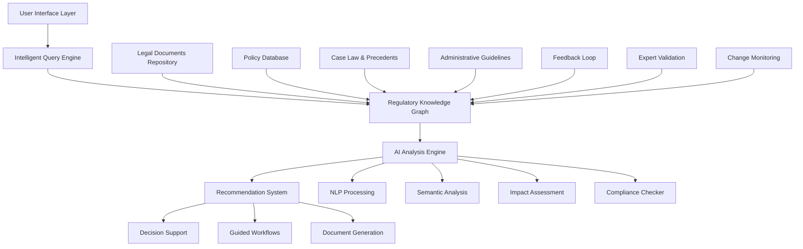
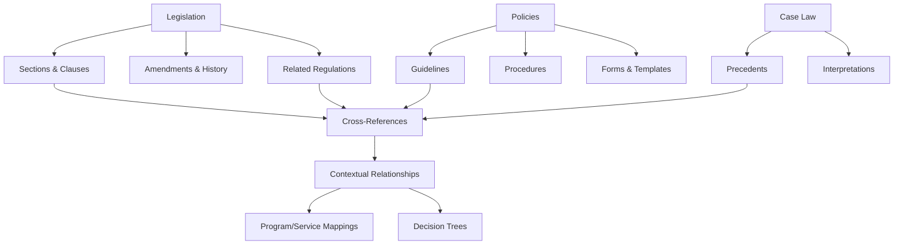
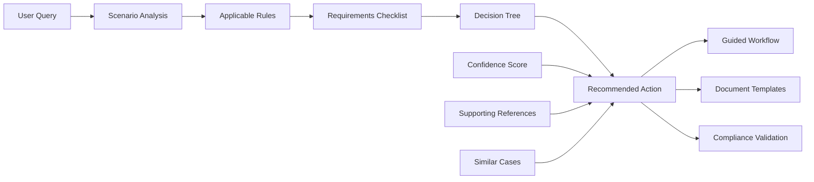
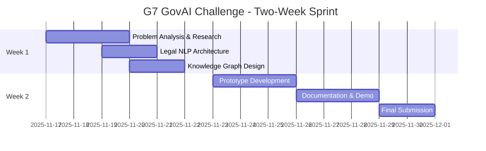
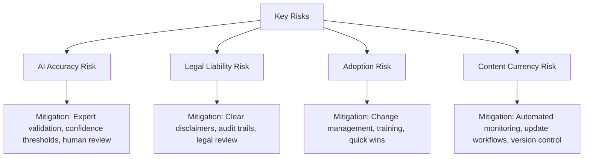

# Feature Idea: Regulatory Intelligence Assistant for Public Service

## G7 GovAI Grand Challenge Submission

**Challenge:** Statement 2 - Navigating Complex Regulations  
**Competition Period:** November 17 to December 1, 2025  
**Challenge Host:** Government of Canada (Treasury Board Secretariat)  
**Objective:** Streamline interpretation and application of rules to increase consistency and compliance, reducing cognitive load on employees

## Overview

An AI-powered regulatory intelligence platform that helps public service employees and citizens navigate complex laws, policies, and regulations. The system automatically identifies relevant legislation, interprets regulatory requirements, ensures consistent application of rules, and reduces cognitive load on employees through intelligent recommendations and guided workflows. It serves as a trusted advisor for program applications, service delivery, and compliance management.

This proposal responds to the G7 GovAI Grand Challenge by presenting a practical, scalable solution that can be adopted across G7 countries to improve public service delivery and reduce the burden of regulatory complexity.

## Problem Statement (Public Service Context)

Public service organizations face significant challenges with regulatory complexity:

1. **Information Overload**: Thousands of laws, policies, regulations, and guidelines exist across federal, provincial/state, and municipal jurisdictions
2. **Complexity & Ambiguity**: Legal language is dense, cross-references are numerous, and interpretation requires specialized expertise
3. **Inconsistent Application**: Different employees interpret the same rules differently, leading to inconsistent decisions and potential non-compliance
4. **High Cognitive Load**: Employees spend excessive time researching regulations instead of serving clients, leading to burnout and errors
5. **Frequent Changes**: Regulations are constantly updated; keeping track of changes and their implications is nearly impossible manually
6. **Client Confusion**: Citizens and businesses struggle to understand what rules apply to their situation, leading to incorrect applications and frustration
7. **Risk & Liability**: Incorrect application of regulations can result in legal challenges, financial penalties, and reputational damage
8. **Training Burden**: New employees need months to learn regulatory frameworks; knowledge transfer from experienced staff is inefficient

## Proposed Solution

### Core System Architecture

### Key Components

#### 1. **Regulatory Knowledge Graph**

**Features:**
- Structured representation of all federal, provincial/state, municipal laws and regulations
- Semantic relationships between legal concepts, requirements, and exceptions
- Historical versioning to track changes over time
- Cross-jurisdictional mapping for multi-level government operations
- Integration with official legislative databases and government portals

#### 2. **Intelligent Query Engine**

**Natural Language Processing:**
- Understands queries in plain language from employees and citizens
- Extracts key entities: person types, situations, programs, jurisdictions
- Handles ambiguous or incomplete information with clarifying questions
- Multi-language support for bilingual public services

**Contextual Understanding:**
- Considers user role, department, program area
- Remembers conversation history for follow-up questions
- Adapts responses based on user expertise level
- Identifies implicit requirements not explicitly stated

#### 3. **AI Analysis Engine**

**Core Capabilities:**
- **Relevance Ranking**: Identifies which laws/policies apply to specific scenarios
- **Conflict Detection**: Flags contradictions between different regulations
- **Impact Analysis**: Assesses how regulatory changes affect existing programs
- **Precedent Matching**: Finds similar past cases and their outcomes
- **Gap Analysis**: Identifies missing information needed for compliance

**AI/ML Models:**
- **BERT/GPT-based Legal Language Models**: Fine-tuned on government legal corpus
- **Named Entity Recognition**: Extracts legal entities, dates, amounts, requirements
- **Classification Models**: Categorizes regulations by topic, jurisdiction, applicability
- **Similarity Detection**: Finds relevant case law and precedents
- **Change Detection**: Monitors legislative updates and assesses impact

#### 4. **Decision Support & Recommendation System**

**Features:**
- Step-by-step guided workflows for complex processes
- Real-time compliance checking as forms are completed
- Confidence scores for recommendations with uncertainty indicators
- Explanation of reasoning with legal citations
- Alternative paths when multiple valid interpretations exist
- Escalation triggers for complex cases requiring human expert review

#### 5. **Knowledge Management & Updates**

**Automated Monitoring:**
- Daily scanning of official legislative websites and gazettes
- Alert system for new or amended regulations affecting specific programs
- Impact assessment reports for pending legislative changes
- Subscription-based notifications for relevant regulatory areas

**Expert Collaboration:**
- Legal experts validate AI recommendations
- Crowd-sourced feedback from caseworkers improves accuracy
- Continuous learning from user corrections and edge cases
- Knowledge base articles created from frequently asked questions

#### 6. **Multi-Channel Access**

**User Interfaces:**
- **Employee Portal**: Full-featured desktop application for caseworkers
- **Citizen Portal**: Simplified interface for public self-service
- **Mobile App**: On-the-go access for field workers
- **Chatbot**: Conversational interface for quick queries
- **API**: Integration with existing case management systems
- **Email Assistant**: Query via email for remote or offline scenarios

## Expected Benefits (Public Service Impact)

### For Employees

**Efficiency Gains:**
- **60-75% reduction** in time spent researching regulations (from hours to minutes)
- **40-50% faster** case processing and application reviews
- Enable handling **30% more cases** with same staffing levels
- Reduce training time for new employees from 6 months to 2 months

**Quality Improvements:**
- **80% reduction** in decision inconsistencies across caseworkers
- **90% reduction** in regulatory interpretation errors
- **70% improvement** in compliance rates
- Real-time guidance reduces escalations to supervisors by 50%

**Work Experience:**
- Reduced cognitive load and job-related stress
- More time for meaningful client interaction
- Increased confidence in decision-making
- Professional development through learning from AI explanations

### For Citizens & Businesses

**User Experience:**
- **Clear guidance** on which regulations apply to their situation
- **Reduced application errors** by 60-70% through pre-submission validation
- **Faster processing** of applications and permits
- **Consistent treatment** regardless of which employee handles their case
- **Self-service options** reduce need for in-person visits

**Transparency:**
- Understanding of legal requirements and reasoning behind decisions
- Ability to verify compliance before submitting applications
- Clear explanation of appeals processes and rights

### For Organizations

**Cost Savings:**
- $2-5M annually per large department through efficiency gains
- Reduced legal challenges and appeals (30-40% reduction)
- Lower training and onboarding costs
- Decreased need for redundant expert consultations

**Risk Management:**
- Audit trail of decision rationale for accountability
- Reduced liability from non-compliant decisions
- Proactive identification of regulatory conflicts
- Early warning system for legislative impacts

**Strategic Planning:**
- Analytics on regulatory bottlenecks and pain points
- Evidence-based input for policy reform recommendations
- Resource planning based on regulatory complexity metrics

## Technical Considerations (System Integration)

### Technology Stack

```mermaid
flowchart TD
    A[Frontend] --> B[React/Next.js Web App]
    A --> C[React Native Mobile]
    A --> D[Chatbot UI]
    
    E[API Gateway] --> F[GraphQL/REST APIs]
    E --> G[Authentication - OAuth2/SAML]
    
    H[Backend Services] --> I[Python FastAPI Microservices]
    H --> J[Node.js Event Processing]
    
    K[AI/ML Layer] --> L[Hugging Face Transformers]
    K --> M[OpenAI GPT-4/Claude API]
    K --> N[Custom Legal NLP Models]
    K --> O[Vector Database - Pinecone/Weaviate]
    
    P[Data Layer] --> Q[PostgreSQL - Structured Data]
    P --> R[Neo4j - Knowledge Graph]
    P --> S[Elasticsearch - Search Index]
    P --> T[Redis - Caching]
    
    U[Integration] --> V[Government Legal APIs]
    U --> W[Case Management Systems]
    U --> X[Document Management]
```

### Data Architecture

**Regulatory Content Management:**
- **Source of Truth**: Official government legislative databases (APIs where available)
- **Content Pipeline**: Automated ingestion, parsing, and structuring of legal documents
- **Version Control**: Git-like versioning for all regulatory content
- **Metadata**: Tagging with jurisdiction, topic, program area, effective dates
- **Quality Assurance**: Expert review workflow for AI-generated interpretations

**Knowledge Graph Structure:**
- **Nodes**: Legislation, regulations, policies, sections, clauses, programs, services
- **Edges**: References, amendments, dependencies, conflicts, precedents
- **Properties**: Effective dates, jurisdiction, authority, confidence scores
- **Semantic Layer**: Ontology mapping legal concepts and relationships

### AI/ML Implementation

**Natural Language Processing:**
- **Document Processing**: OCR for scanned documents, PDF parsing, HTML extraction
- **Text Preprocessing**: Legal-specific tokenization, entity recognition, coreference resolution
- **Embeddings**: Domain-adapted sentence transformers for semantic search
- **Question Answering**: Fine-tuned models on government Q&A datasets
- **Summarization**: Extractive and abstractive summarization for long documents

**RAG & Document Management Options:**
- **Gemini API File Search**: Google's managed RAG solution for legal and regulatory documents
  - Integrated file upload and management capabilities
  - Automatic chunking, embedding generation, and semantic search
  - Supports PDF, TXT, HTML, and other common document formats
  - Built-in caching for improved performance and reduced costs
  - Seamless integration with Gemini models for legal Q&A and interpretation
  - Documentation: https://ai.google.dev/gemini-api/docs/file-search
- **Custom RAG Implementation**: Vector databases (Pinecone, Weaviate) with specialized legal embeddings
- **Hybrid Approach**: Combine Gemini API for regulatory document search with Neo4j knowledge graph for relationship mapping

**Retrieval-Augmented Generation (RAG) Features:**
- Hybrid search combining keyword and semantic matching
- Context-aware re-ranking of results
- Multi-hop reasoning for complex queries requiring multiple regulatory sources
- Grounded generation with explicit source citations

**Continuous Learning:**
- Active learning from expert feedback
- Reinforcement learning from human preferences (RLHF)
- A/B testing of model improvements
- Regular retraining with new regulations and case outcomes

### Integration Requirements

**Government Systems:**
- Case management systems (intake, tracking, disposition)
- Document management and records systems
- Identity and access management (IAM)
- Employee directories and organizational structure
- Public-facing portals and service catalogs

**External Data Sources:**
- Federal legislative databases (Parliament, Congress websites)
- Provincial/state legislative assemblies
- Municipal bylaws and regulations
- Legal research databases (CanLII, WestLaw, LexisNexis)
- Administrative tribunals and court decisions

### Security & Compliance

**Data Protection:**
- **Confidentiality**: No personal case data stored; only anonymized usage patterns
- **Integrity**: Cryptographic verification of regulatory content authenticity
- **Availability**: High availability architecture with 99.95% uptime SLA

**Access Controls:**
- Role-based access control (RBAC) aligned with organizational structure
- Multi-factor authentication (MFA) for employee access
- Audit logging of all queries and recommendations
- Data residency compliance (within Canada/US as required)

**Ethical AI:**
- Explainable AI with transparent reasoning
- Bias detection and mitigation in recommendations
- Human-in-the-loop for high-stakes decisions
- Regular fairness audits and impact assessments

## G7 Challenge Proposal: Two-Week Rapid Solution Design

### Challenge Timeline (Nov 17 - Dec 1, 2025)

**Challenge Deliverables (by December 1, 2025):**
1. Comprehensive solution architecture for regulatory intelligence system
2. Proof-of-concept prototype demonstrating legal NLP and search capabilities
3. Responsible AI framework for legal AI systems (bias, transparency, accountability)
4. Implementation roadmap for G7 government adoption
5. Cost-benefit analysis showing reduced cognitive load and improved consistency
6. Presentation and demonstration materials

### Post-Challenge Pathway (if selected)

**Early 2026: Showcase & Funding**
- Present to G7 GovAI network and expert panel
- Potential award of up to $10,000 CAD
- Partner with G7 government for pilot deployment

**Months 1-3 (if funded):**
- Expand to 500-1000 documents
- Multi-department testing
- Enhanced NLP models
- Basic case management integration

**Months 4-6:**
- Deploy to 2-3 departments
- 200-500 active users
- Guided workflows
- Compliance checking features

**Months 7-12:**
- Multi-jurisdiction support
- Citizen-facing portal
- Mobile applications
- Share with G7 AI Network (GAIN)

## Initial Scope

### In Scope for G7 Challenge Submission (Nov 17 - Dec 1, 2025)

**What We'll Deliver in Two Weeks:**
1. **Solution Architecture & Design**
   - Detailed system architecture for regulatory intelligence
   - Legal NLP model design and approach
   - Knowledge graph structure for regulations
   - User interface mockups for employees and citizens
   - API specifications for system integration

2. **Proof-of-Concept Prototype**
   - Working demo using publicly available legislation (e.g., sample federal laws)
   - Basic semantic search across regulatory documents
   - Question answering capability for legal queries
   - Example of automatic relevance identification
   - Simple summarization of regulations

3. **Responsible AI Framework for Legal Systems**
   - Bias detection and mitigation in legal AI
   - Explainability and transparency requirements
   - Human-in-the-loop oversight mechanisms
   - Data privacy and security measures
   - Ethical guidelines for AI-assisted legal decisions

4. **Implementation Roadmap**
   - Phased deployment plan for G7 adoption
   - Cost estimates and ROI analysis
   - Risk assessment and mitigation
   - Success metrics (accuracy, time savings, consistency)
   - Stakeholder engagement strategy

5. **Demonstration Package**
   - Technical documentation and specifications
   - Video demonstration of prototype
   - Use cases and user stories
   - Presentation for judging panel

### In Scope for MVP (if selected for funding)

**Core Features:**
1. **Regulatory Search Engine**
   - Natural language query interface
   - Semantic search across federal legislation
   - Filtering by jurisdiction, program area, date
   - Citation and cross-reference navigation

2. **Relevance Identification**
   - Input program/service application scenarios
   - AI identifies applicable laws and regulations
   - Ranked by relevance with confidence scores
   - Summary of key requirements

3. **Guided Q&A**
   - Conversational interface for complex questions
   - Clarifying questions to narrow scope
   - Step-by-step guidance for common workflows
   - Explanation of reasoning with legal citations

4. **Knowledge Base**
   - FAQs generated from common queries
   - Templates for common decision scenarios
   - Glossary of legal terms
   - User feedback mechanism

5. **Content Coverage**
   - Federal legislation for 2-3 pilot program areas (e.g., employment insurance, immigration, tax benefits)
   - 500-1000 regulatory documents ingested
   - 100+ decision workflows documented

### Out of Scope for MVP
- Provincial/state and municipal regulations (Phase 2)
- Real-time change monitoring (Phase 2)
- Citizen-facing portal (Phase 2)
- Mobile applications (Phase 2)
- Case management system integration (Phase 2)
- Multi-language support beyond English (Phase 3)
- Automated document generation (Phase 3)

### Success Criteria for MVP

**Technical Metrics:**
- **Search Accuracy**: 75%+ precision and recall on test queries
- **Response Time**: <3 seconds for 95% of queries
- **System Availability**: 99.5% uptime during business hours
- **Scalability**: Support 100 concurrent users

**User Adoption:**
- **Active Users**: 70% of pilot employees use system weekly
- **Query Volume**: 500+ queries per week by end of pilot
- **User Satisfaction**: 4/5 average rating
- **Feature Usage**: 60% of users try guided workflows

**Business Impact:**
- **Time Savings**: 50% reduction in regulatory research time
- **Accuracy**: 30% reduction in interpretation errors
- **Confidence**: 80% of users report increased confidence in decisions
- **ROI**: Demonstrated cost savings of $200K+ in pilot department

## Implementation Approach

### Development Methodology
- **Agile/Scrum**: 2-week sprints with continuous user feedback
- **AI-TDD**: Test-driven development with legal expert validation
- **LegalOps**: Collaboration between legal experts, technologists, and end-users
- **Responsible AI**: Ethics review, bias testing, and transparency requirements

### Team Structure (2-Week MVP / 4-Person Team)
- **Full-Stack Developer**: 1 (React + Python/FastAPI)
- **AI/ML Engineer**: 1 (Legal NLP, RAG, Knowledge Graphs)
- **Legal/Domain Expert**: 1 (Regulation Curation, Testing)
- **UX Designer/Frontend Developer**: 1 (Interface, Workflows)

### Timeline & Budget Estimate

**G7 Challenge Phase (Nov 17 - Dec 1, 2025):**
- **Duration**: 2 weeks to MVP
- **Team**: 4 people (Full-Stack Dev, AI/ML Engineer, Legal Expert, UX Designer)
- **Competition Effort**: Intensive 2-week sprint
- **Potential Award**: Up to $10,000 CAD (if selected)

**Post-Challenge Development (if funded):**
- **Months 1-3**: Expand to 500-1000 documents, multi-department, $75-150K
- **Months 4-6**: Deploy to 2-3 departments, 200-500 users, $200-400K
- **Months 7-12**: Multi-jurisdiction, citizen portal, mobile apps, $500K-1M

### Risk Mitigation

### Next Steps for G7 Challenge Submission

**Week 1 (Nov 17-23, 2025):**
1. **Research & Problem Analysis** (Days 1-2)
   - Study regulatory complexity challenges across G7 countries
   - Research legal NLP state-of-the-art (LegalBERT, CaseLaw models)
   - Identify publicly available legal datasets for demonstration

2. **Architecture & Design** (Days 3-5)
   - Finalize system architecture and components
   - Design knowledge graph schema for regulations
   - Create user interface mockups
   - Develop responsible AI framework for legal systems

**Week 2 (Nov 24-Dec 1, 2025):**
3. **Prototype Development** (Days 6-8)
   - Build proof-of-concept with sample legislation
   - Implement semantic search and Q&A
   - Create interactive demo for judges
   - Test with sample legal queries

4. **Documentation & Submission** (Days 9-14)
   - Complete technical documentation
   - Prepare presentation and video demonstration
   - Write impact analysis and cost-benefit assessment
   - Submit to Impact Canada platform by December 1, 2025

**Post-Submission:**
- Await judging (December 2025 - January 2026)
- Prepare for showcase presentation (Early 2026)
- If selected: Begin partnership with G7 government agencies

---

*This proposal is submitted for the G7 GovAI Grand Challenge (Nov 17 - Dec 1, 2025), advancing responsible AI to help public servants navigate complex regulations. The solution emphasizes explainability, legal accuracy, and human oversight to ensure trust and compliance.*
