# Parallel Execution Plan: Regulatory Intelligence Assistant

**Version:** 1.1 (Rebalanced)  
**Date:** November 19, 2025  
**Project:** G7 GovAI Grand Challenge MVP  
**Timeline:** 2 weeks (Nov 17 - Dec 1, 2025)  
**Team Size:** 4 people  
**Original Plan:** [plan.md](./plan.md)

## Overview

This parallel execution plan reorganizes the sequential implementation plan into independent work streams that can run simultaneously without conflicts. The plan organizes work by technical domains: backend infrastructure, knowledge graph, search systems, and frontend UI.

### Parallelization Strategy

The work is organized by functional areas and dependencies:

* **Backend infrastructure** and **Knowledge graph** established first
* **Document ingestion** and **NLP processing** can progress in parallel
* **Search services** and **RAG system** built independently
* **Frontend development** happens alongside backend services
* **Testing and demo** integrate all components

### Time Savings

* **Sequential execution**: ~14 days
* **Parallel execution**: ~9-10 days
* **Time saved**: 30-40%

---

## Workload Balance Summary

**Developer 1 - Backend & Compliance:** 39 hours

- Stream 1A: Backend Setup & Database (14h)
- Stream 4A: Compliance Checking Engine (10h)
- Step 14: Compliance Testing (8h)
- Step 18: Documentation & Deployment (4h)
- Integration support (3h)

**Developer 2 - Search & RAG:** 38 hours

- Stream 2B: Legal NLP Processing (8h)
- Stream 3A: Elasticsearch Integration (10h)
- Stream 3B: Gemini RAG System (12h)
- Step 13: Search Quality Testing (5h)
- Integration testing (3h)

**Developer 3 - Knowledge Graph & Data:** 41 hours

- Stream 1B: Neo4j Graph Setup (10h)
- Stream 2A: Document Parsing & Graph Population (22h)
- Step 16: Sample Regulatory Dataset (6h)
- Step 18: Documentation (3h)

**Developer 4 - Frontend & Integration:** 42 hours

- Stream 3A: Hybrid Search Implementation (10h)
- Stream 4B: Frontend Development (20h)
- Step 13: Search Quality Testing (5h)
- Step 15: Integration & E2E Testing (8h)
- Step 17: Demo Video Production (8h)

**Maximum variance: 4 hours** (vs. 35 hours in original allocation)

---

## Parallel Work Streams

```mermaid
flowchart LR
    Phase1A["Stream 1A: Backend Setup"] --> Integration1["Phase 1 Integration"]
    Phase1B["Stream 1B: Neo4j Graph"] --> Integration1

    Integration1 --> Phase2A["Stream 2A: Document Ingestion"]
    Integration1 --> Phase2B["Stream 2B: Legal NLP"]

    Phase2A --> Integration2["Phase 2 Integration"]
    Phase2B --> Integration2

    Integration2 --> Phase3A["Stream 3A: Elasticsearch Search"]
    Integration2 --> Phase3B["Stream 3B: Gemini RAG"]

    Phase3A --> Integration3["Phase 3 Integration"]
    Phase3B --> Integration3

    Integration3 --> Phase4A["Stream 4A: Compliance Engine"]
    Integration3 --> Phase4B["Stream 4B: Frontend UI"]

    Phase4A --> Integration4["Phase 4 Integration"]
    Phase4B --> Integration4

    Integration4 --> Phase5["Stream 5: Testing & Demo"]
    Phase5 --> Final["Final Delivery"]
```

---

## Phase 1: Foundation (Days 1-2)

**Goal:** Establish backend infrastructure and knowledge graph foundation

### Stream 1A: Backend Setup & Database

**Independence:** No dependencies on other streams; works with backend files only  
**Assigned To:** Developer 1  
**Duration:** 14 hours (Days 1-2)  
**Total Workload for Dev 1:** 39 hours

**Tasks:**

* [ ] **Step 1:** Project Setup and Infrastructure (8 hours)
  
  * Initialize project with React frontend and FastAPI backend
  * Set up Docker Compose with PostgreSQL, Neo4j, Elasticsearch, Redis
  * Configure environment variables and CI/CD
  * Create health check endpoints for all services
  * **Files:** `docker-compose.yml`, `.github/workflows/ci.yml`, `backend/main.py`

* [ ] **Step 2:** Database Schema and Models (6 hours)
  
  * Create PostgreSQL schema for metadata (regulations, users, queries, workflows)
  * Implement SQLAlchemy models with relationships
  * Set up Alembic migrations
  * Create database seeding with sample data
  * Add indexes for performance
  * **Files:** `backend/models.py`, `backend/database.py`, `backend/alembic/versions/*.py`

**Verification:**

* [ ] All services run with `docker-compose up`
* [ ] Neo4j browser accessible at localhost:7474
* [ ] Elasticsearch running on localhost:9200
* [ ] Database migrations complete successfully
* [ ] Sample data seeds correctly

---

### Stream 1B: Neo4j Knowledge Graph Setup

**Independence:** Depends on Docker from Step 1; then works independently  
**Assigned To:** Developer 3  
**Duration:** 10 hours (Day 1 afternoon - Day 2)  
**Total Workload for Dev 3:** 41 hours

**Tasks:**

* [ ] **Step 3:** Neo4j Knowledge Graph Setup (10 hours)
  * Define Neo4j node and relationship types
  * Create Cypher schema initialization scripts
  * Implement Neo4j connection and query utilities
  * Build graph builder service for regulations
  * Create sample graph with 10-20 regulations
  * **Files:** `backend/services/graph_service.py`, `backend/scripts/init_graph.cypher`, `backend/utils/neo4j_client.py`

**Verification:**

* [ ] Neo4j connection established
* [ ] Node types created (Legislation, Section, Regulation, Policy)
* [ ] Relationships defined (HAS_SECTION, REFERENCES, APPLIES_TO)
* [ ] Sample graph queryable
* [ ] Graph visualization works in Neo4j Browser

---

### Integration Point 1 (Day 2 afternoon)

**Actions:**

* Verify all infrastructure components communicate
* Test database and graph connectivity
* Run smoke tests for all services
* Validate data flow

**Duration:** 1-2 hours

---

## Phase 2: Document Processing (Days 3-4)

**Goal:** Build document ingestion and NLP processing pipelines

### Stream 2A: Document Parsing & Graph Population

**Independence:** Works with document processing; no conflicts with NLP  
**Assigned To:** Developer 3  
**Duration:** 22 hours (Days 3-5)

**Tasks:**

* [ ] **Step 4:** Document Parser and Ingestion (12 hours)
  
  * Create regulatory document upload API
  * Implement PDF/HTML/XML parsing
  * Extract sections, subsections, and clauses
  * Parse cross-references between regulations
  * Store structured documents in PostgreSQL
  * **Files:** `backend/services/document_parser.py`, `backend/routes/documents.py`, `backend/utils/legal_text_parser.py`

* [ ] **Step 5:** Knowledge Graph Population (10 hours)
  
  * Build graph construction pipeline from parsed documents
  * Create nodes for legislation, sections, regulations
  * Extract and create relationship edges
  * Implement entity linking (programs, situations)
  * Populate graph with 50-100 regulations
  * **Files:** `backend/services/graph_builder.py`, `backend/tasks/populate_graph.py`

**Verification:**

* [ ] Can upload PDF, HTML, XML documents
* [ ] Document structure extracted correctly
* [ ] All regulations represented as nodes
* [ ] Relationships created automatically
* [ ] 50-100 regulations in graph

---

### Stream 2B: Legal NLP Processing

**Independence:** Works with NLP services; no conflicts with document parsing  
**Assigned To:** Developer 2  
**Duration:** 8 hours (Days 3-4)  
**Total Workload for Dev 2:** 38 hours

**Tasks:**

* [ ] **Step 6:** Legal NLP Processing (8 hours)
  * Implement legal entity extraction (person types, programs, jurisdictions)
  * Create query parser for natural language questions
  * Build intent classifier (search, compliance, interpretation)
  * Add legal terminology synonym expansion
  * Store NLP results in database
  * **Files:** `backend/services/legal_nlp.py`, `backend/services/query_parser.py`

**Verification:**

* [ ] Entities extracted with >80% accuracy
* [ ] Query parser handles legal questions
* [ ] Intent classification >85% accurate
* [ ] Synonyms improve recall
* [ ] NLP metadata stored

---

### Integration Point 2 (Day 4 afternoon - Day 5)

**Actions:**

* Test document ingestion pipeline end-to-end
* Verify knowledge graph completeness
* Test NLP processing on real queries
* Performance testing

**Duration:** 2 hours

---

## Phase 3: Search & RAG (Days 5-7)

**Goal:** Build search infrastructure and RAG system in parallel

### Stream 3A: Hybrid Search System

**Independence:** Works with search services; no conflicts with RAG  
**Assigned To:** Developer 2 (Elasticsearch) + Developer 4 (Hybrid Search)  
**Duration:** 20 hours (Days 5-7)

**Tasks:**

* [ ] **Step 7:** Elasticsearch Integration (10 hours - Developer 2)
  
  * Create Elasticsearch index with custom analyzers
  * Index regulatory documents with embeddings
  * Implement keyword search with legal-specific analysis
  * Add vector search for semantic matching
  * Configure search relevance tuning
  * **Files:** `backend/services/search_service.py`, `backend/config/elasticsearch_mappings.json`

* [ ] **Step 8:** Hybrid Search Implementation (10 hours - Developer 4)
  
  * Combine keyword (BM25) and vector search
  * Add graph-based search using Neo4j traversal
  * Implement result fusion with weighted scoring
  * Add filtering by jurisdiction, date, type
  * Create search result ranking
  * **Files:** `backend/services/hybrid_search.py`, `backend/services/graph_query.py`

**Verification:**

* [ ] Documents indexed successfully
* [ ] Keyword search returns relevant results
* [ ] Hybrid search improves relevance
* [ ] Graph search finds related regulations
* [ ] Search latency <500ms

---

### Stream 3B: Gemini RAG System

**Independence:** Works with RAG services; no conflicts with search  
**Assigned To:** Developer 2  
**Duration:** 12 hours (Days 6-7)

**Tasks:**

* [ ] **Step 9:** Gemini RAG System (12 hours)
  * Upload regulatory documents to Gemini File API
  * Implement Q&A service using Gemini RAG
  * Create citation extraction from responses
  * Add confidence scoring for answers
  * Build answer caching mechanism
  * **Files:** `backend/services/rag_service.py`, `backend/services/gemini_client.py`

**Verification:**

* [ ] Documents uploaded to Gemini successfully
* [ ] Q&A returns accurate answers
* [ ] Citations reference specific sections
* [ ] Confidence scores calculated
* [ ] Responses cached for performance

---

### Integration Point 3 (Day 7 afternoon)

**Actions:**

* Test search and RAG together
* Verify search results feed into RAG correctly
* Test citation accuracy
* Performance optimization

**Duration:** 2-3 hours

---

## Phase 4: Compliance & Frontend (Days 8-10)

**Goal:** Build compliance engine and user interface

### Stream 4A: Compliance Checking Engine

**Independence:** Works with compliance services; no conflicts with frontend  
**Assigned To:** Developer 1  
**Duration:** 10 hours (Days 8-9)

**Tasks:**

* [ ] **Step 10:** Compliance Checking Engine (10 hours)
  * Define compliance check rules and logic
  * Implement requirement extraction from regulations
  * Build form validation against requirements
  * Create compliance report generation
  * Add suggestion system for issues
  * **Files:** `backend/services/compliance_checker.py`, `backend/schemas/compliance_rules.py`

**Verification:**

* [ ] Requirements extracted correctly
* [ ] Form validation detects issues
* [ ] Compliance reports generated
* [ ] Suggestions help users fix issues
* [ ] Accuracy >80% on test cases

---

### Stream 4B: Frontend Development

**Independence:** Works with frontend files; no conflicts with backend services  
**Assigned To:** Developer 4  
**Duration:** 20 hours (Days 8-10)  
**Total Workload for Dev 4:** 42 hours

**Tasks:**

* [ ] **Step 11:** React Frontend Development (12 hours)
  
  * Set up React with TypeScript and Tailwind CSS
  * Create search interface with natural language input
  * Build Q&A chat interface
  * Implement regulation viewer with highlights
  * Add filter sidebar and result display
  * **Files:** `frontend/src/App.tsx`, `frontend/src/components/SearchInterface.tsx`, `frontend/src/components/ChatInterface.tsx`

* [ ] **Step 12:** Workflow and Guidance UI (8 hours)
  
  * Create guided workflow component
  * Build step-by-step form assistance
  * Implement compliance checking UI
  * Add progress tracking visualization
  * Display recommendations and next steps
  * **Files:** `frontend/src/components/WorkflowEngine.tsx`, `frontend/src/components/ComplianceReport.tsx`

**Verification:**

* [ ] Search interface intuitive and responsive
* [ ] Chat interface works smoothly
* [ ] Regulation viewer displays content clearly
* [ ] Workflow guides users through steps
* [ ] Compliance issues displayed clearly

---

### Integration Point 4 (Day 10 afternoon)

**Actions:**

* Connect frontend to all backend services
* Test complete user workflows
* Verify compliance checking works end-to-end
* Cross-browser compatibility testing

**Duration:** 2-3 hours

---

## Phase 5: Testing & Demo (Days 11-14)

**Goal:** Comprehensive testing, validation, and demo preparation

### Stream 5: Integrated Testing & Demo

**Independence:** Integration phase after all features complete  
**Assigned To:** All team members  
**Duration:** 40 hours (Days 11-14)

**Tasks:**

* [ ] **Step 13:** Search and RAG Quality Testing (10 hours - Developer 2 + 4)
  
  * Create test query set with expected results
  * Measure search precision and recall
  * Evaluate RAG answer quality with legal experts
  * Test citation accuracy
  * Conduct user testing with 3-5 caseworkers
  * **Files:** `backend/tests/test_search_quality.py`, `evaluation/test_queries.json`

* [ ] **Step 14:** Compliance Testing (8 hours - Developer 1)
  
  * Create test scenarios for compliance checking
  * Test with valid and invalid form submissions
  * Verify requirement extraction accuracy
  * Test edge cases and corner cases
  * Validate suggestions quality
  * **Files:** `backend/tests/test_compliance.py`, `test_scenarios/compliance_cases.json`

* [ ] **Step 15:** Integration and E2E Testing (8 hours - Developer 4 lead + All)
  
  * Write integration tests for all API endpoints
  * Create E2E tests for search → answer workflow
  * Test compliance checking workflow end-to-end
  * Conduct load testing with 50+ concurrent users
  * Fix identified bugs
  * **Files:** `backend/tests/test_integration.py`, `frontend/tests/e2e/*.spec.ts`

* [ ] **Step 16:** Sample Regulatory Dataset (6 hours - Developer 3)
  
  * Curate 50-100 government regulations
  * Process through ingestion pipeline
  * Verify knowledge graph completeness
  * Create example search queries
  * Prepare compliance test scenarios
  * **Deliverables:** `data/sample_regulations/`, `demo_queries.md`

* [ ] **Step 17:** Demo Video Production (8 hours - Developer 4)
  
  * Write demo script showing key features
  * Record regulatory search demonstration
  * Show Q&A interaction with citations
  * Demonstrate compliance checking workflow
  * Edit video with narration and captions
  * **Deliverables:** `demo-video.mp4`, `demo-script.md`

* [ ] **Step 18:** Documentation and Deployment (7 hours - Developer 1 + 3)
  
  * Write comprehensive README with setup instructions
  * Document API endpoints with examples
  * Create deployment guide for cloud platforms
  * Document knowledge graph schema
  * Deploy to cloud instance
  * Set up monitoring and logging
  * **Deliverables:** `README.md`, `API_DOCS.md`, `DEPLOYMENT.md`, `KNOWLEDGE_GRAPH.md`

**Verification:**

* [ ] Search Precision@10 >80%
* [ ] RAG answers rated >4/5 by experts
* [ ] Citations accurate and specific
* [ ] Compliance checking accurate
* [ ] All integration tests pass
* [ ] Demo video compelling (3-5 minutes)
* [ ] Application deployed successfully

---

## Quality Gates (All Phases)

### Knowledge Graph

* [ ] 50-100 regulations represented
* [ ] Relationships extracted automatically
* [ ] Graph structure coherent and queryable
* [ ] Entity linking >80% accurate
* [ ] Graph queries execute in <1 second

### Search Quality

* [ ] Keyword search Precision@10 >80%
* [ ] Semantic search works for concepts
* [ ] Hybrid search improves relevance
* [ ] Graph search finds related regulations
* [ ] Search latency <500ms (p95)

### RAG System

* [ ] Answer quality rated >4/5 by experts
* [ ] Citations accurate and specific
* [ ] Confidence scores reliable
* [ ] Response time <5 seconds
* [ ] Handles complex legal questions

### Compliance Checking

* [ ] Requirement extraction >80% accurate
* [ ] False positive rate <10%
* [ ] False negative rate <5%
* [ ] Suggestions helpful and actionable
* [ ] Processing time <2 seconds

### Code Quality

* [ ] Test coverage >70%
* [ ] No critical security vulnerabilities
* [ ] Code follows style guidelines
* [ ] All TypeScript types defined
* [ ] Documentation complete

---

## Risk Management

### Potential Conflicts

* **RAG Accuracy:** Mitigated by expert validation and Gemini API quality
* **Graph Complexity:** Simplified relationships for MVP scope
* **Regulation Quality:** Manual curation and validation process
* **Timeline Pressure:** Parallel execution and clear MVP focus

### Communication Protocol

* **Daily Standups:** 15 minutes to sync progress across streams
* **Integration Checkpoints:** End of each phase for synchronization
* **Blocker Escalation:** Immediate notification if stream blocked
* **Code Reviews:** Required before merging each stream's work

---

## Execution Timeline

**Phase 1:** Days 1-2 (Foundation)  
**Integration 1:** Day 2 afternoon  
**Phase 2:** Days 3-4 (Document Processing)  
**Integration 2:** Day 4 afternoon - Day 5  
**Phase 3:** Days 5-7 (Search & RAG)  
**Integration 3:** Day 7 afternoon  
**Phase 4:** Days 8-10 (Compliance & Frontend)  
**Integration 4:** Day 10 afternoon  
**Phase 5:** Days 11-14 (Testing & Demo)  
**Final Delivery:** End of Day 14

---

## Success Criteria

* [ ] All parallel streams complete independently
* [ ] Integration points successful with minimal conflicts
* [ ] 30-40% time saved compared to sequential execution
* [ ] 50-100 regulations in knowledge graph
* [ ] Search precision >80%
* [ ] RAG answer quality >4/5
* [ ] Compliance checking accurate
* [ ] Demo video compelling and clear
* [ ] Application deployed and accessible
* [ ] Workload balanced across all developers (max 4 hour variance)
