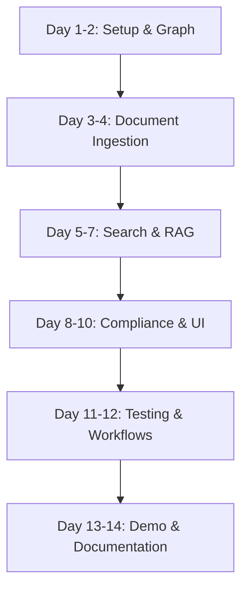
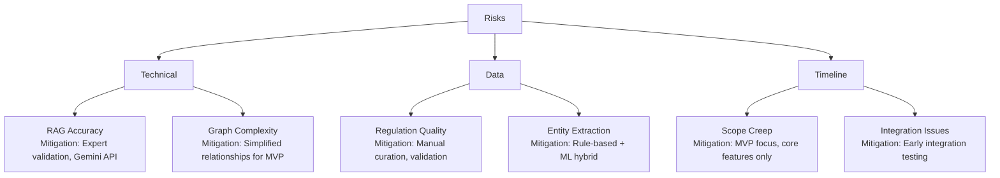

# Implementation Plan: Regulatory Intelligence Assistant for Public Service

**Version:** 1.0  
**Date:** November 19, 2025  
**Project:** G7 GovAI Grand Challenge MVP  
**Timeline:** 2 weeks (Nov 17 - Dec 1, 2025)  
**Team Size:** 4 people  

## Overview

This plan provides a step-by-step implementation roadmap for building the Regulatory Intelligence Assistant MVP. The plan is optimized for a 4-person team with a 2-week timeline, focusing on regulatory knowledge graph construction, semantic search, and Q&A capabilities.

### Team Roles
- **Developer 1:** Full-Stack (React + Python/FastAPI)
- **Developer 2:** AI/ML Engineer (NLP, RAG, Legal Language Processing)
- **Developer 3:** Backend/Graph Engineer (Neo4j, Knowledge Graph, Data Pipeline)
- **Developer 4:** Frontend/UX (Search Interface, Workflow UI)

### MVP Scope
- Regulatory knowledge graph with 50-100 regulations
- Neo4j graph database for relationships
- Semantic search with Elasticsearch
- Q&A system using Gemini API RAG
- Compliance checking for basic scenarios
- Simple web interface for search and Q&A
- Demo video showing regulatory search and compliance

## Implementation Flow

## Pre-Implementation Checklist

- [ ] Development environment setup complete
- [ ] Sample regulatory documents collected (50-100 regulations)
- [ ] API keys obtained (Gemini, OpenAI for embeddings)
- [ ] GitHub repository created with CI/CD
- [ ] Docker and Docker Compose installed
- [ ] Neo4j Desktop/Community Edition installed
- [ ] Elasticsearch configured locally
- [ ] Regulatory taxonomy defined

## Implementation Steps

### Phase 1: Foundation & Knowledge Graph (Days 1-2)

#### Step 1: Project Setup and Infrastructure
**Status:** [ ] Not Started  
**Assigned To:** Developer 1  
**Effort:** 8 hours  
**Dependencies:** None

**Actions:**
1. Initialize project structure with React frontend and FastAPI backend
2. Set up Docker Compose with PostgreSQL, Neo4j, Elasticsearch, Redis
3. Configure environment variables and secrets management
4. Set up GitHub Actions for CI/CD
5. Create health check endpoints for all services

**Verification:**
- [ ] `docker-compose up` runs all services successfully
- [ ] Neo4j browser accessible at localhost:7474
- [ ] Elasticsearch running on localhost:9200
- [ ] GitHub Actions workflow passes
- [ ] Environment variables loaded correctly

**Files Created:**
- `docker-compose.yml`
- `.github/workflows/ci.yml`
- `frontend/package.json`
- `backend/requirements.txt`
- `backend/main.py`

---

#### Step 2: Database Schema and Models
**Status:** [ ] Not Started  
**Assigned To:** Developer 1  
**Effort:** 6 hours  
**Dependencies:** Step 1

**Actions:**
1. Create PostgreSQL schema for metadata from design document
2. Implement SQLAlchemy models for regulations, users, queries, workflows
3. Set up Alembic migrations
4. Create database seeding with sample data
5. Add indexes for performance

**Verification:**
- [ ] All PostgreSQL tables created
- [ ] Migrations run without errors
- [ ] Sample data seeds correctly
- [ ] Indexes improve query performance
- [ ] Foreign key constraints work

**Files Created:**
- `backend/models.py`
- `backend/database.py`
- `backend/alembic/versions/*.py`

---

#### Step 3: Neo4j Knowledge Graph Setup
**Status:** [ ] Not Started  
**Assigned To:** Developer 3  
**Effort:** 10 hours  
**Dependencies:** Step 1

**Actions:**
1. Define Neo4j node and relationship types
2. Create Cypher schema initialization scripts
3. Implement Neo4j connection and query utilities
4. Build graph builder service for regulations
5. Create sample graph with 10-20 regulations

**Verification:**
- [ ] Neo4j connection established
- [ ] Node types created (Legislation, Section, Regulation, Policy)
- [ ] Relationships defined (HAS_SECTION, REFERENCES, APPLIES_TO)
- [ ] Sample graph queryable
- [ ] Graph visualization works in Neo4j Browser

**Files Created:**
- `backend/services/graph_service.py`
- `backend/scripts/init_graph.cypher`
- `backend/utils/neo4j_client.py`

---

### Phase 2: Document Ingestion (Days 3-4)

#### Step 4: Document Parser and Ingestion
**Status:** [ ] Not Started  
**Assigned To:** Developer 3  
**Effort:** 12 hours  
**Dependencies:** Step 2, 3

**Actions:**
1. Create regulatory document upload API
2. Implement PDF/HTML/XML parsing
3. Extract sections, subsections, and clauses
4. Parse cross-references between regulations
5. Store structured documents in PostgreSQL

**Verification:**
- [ ] Can upload PDF, HTML, XML documents
- [ ] Document structure extracted correctly
- [ ] Sections and clauses identified
- [ ] Cross-references parsed
- [ ] Metadata stored in database

**Files Created:**
- `backend/services/document_parser.py`
- `backend/routes/documents.py`
- `backend/utils/legal_text_parser.py`

---

#### Step 5: Knowledge Graph Population
**Status:** [ ] Not Started  
**Assigned To:** Developer 3  
**Effort:** 10 hours  
**Dependencies:** Step 4

**Actions:**
1. Build graph construction pipeline from parsed documents
2. Create nodes for legislation, sections, regulations
3. Extract and create relationship edges
4. Implement entity linking (programs, situations)
5. Populate graph with 50-100 regulations

**Verification:**
- [ ] All regulations represented as nodes
- [ ] Relationships created automatically
- [ ] Entity linking >80% accurate
- [ ] Graph structure coherent
- [ ] 50-100 regulations in graph

**Files Created:**
- `backend/services/graph_builder.py`
- `backend/tasks/populate_graph.py`

---

#### Step 6: Legal NLP Processing
**Status:** [ ] Not Started  
**Assigned To:** Developer 2  
**Effort:** 8 hours  
**Dependencies:** Step 4

**Actions:**
1. Implement legal entity extraction (person types, programs, jurisdictions)
2. Create query parser for natural language questions
3. Build intent classifier (search, compliance, interpretation)
4. Add legal terminology synonym expansion
5. Store NLP results in database

**Verification:**
- [ ] Entities extracted with >80% accuracy
- [ ] Query parser handles legal questions
- [ ] Intent classification >85% accurate
- [ ] Synonyms improve recall
- [ ] NLP metadata stored

**Files Created:**
- `backend/services/legal_nlp.py`
- `backend/services/query_parser.py`

---

### Phase 3: Search & RAG (Days 5-7)

#### Step 7: Elasticsearch Integration
**Status:** [ ] Not Started  
**Assigned To:** Developer 2  
**Effort:** 10 hours  
**Dependencies:** Step 5

**Actions:**
1. Create Elasticsearch index with custom analyzers
2. Index regulatory documents with embeddings
3. Implement keyword search with legal-specific analysis
4. Add vector search for semantic matching
5. Configure search relevance tuning

**Verification:**
- [ ] Documents indexed successfully
- [ ] Keyword search returns relevant results
- [ ] Vector search works for concepts
- [ ] Legal terminology recognized
- [ ] Search latency <500ms

**Files Created:**
- `backend/services/search_service.py`
- `backend/config/elasticsearch_mappings.json`
- `backend/tasks/indexing.py`

---

#### Step 8: Hybrid Search Implementation
**Status:** [ ] Not Started  
**Assigned To:** Developer 2, Developer 3  
**Effort:** 10 hours  
**Dependencies:** Step 7

**Actions:**
1. Combine keyword (BM25) and vector search
2. Add graph-based search using Neo4j traversal
3. Implement result fusion with weighted scoring
4. Add filtering by jurisdiction, date, type
5. Create search result ranking

**Verification:**
- [ ] Hybrid search improves relevance
- [ ] Graph search finds related regulations
- [ ] Result fusion works correctly
- [ ] Filters apply properly
- [ ] Ranking considers multiple signals

**Files Created:**
- `backend/services/hybrid_search.py`
- `backend/services/graph_query.py`

---

#### Step 9: Gemini RAG System
**Status:** [ ] Not Started  
**Assigned To:** Developer 2  
**Effort:** 12 hours  
**Dependencies:** Step 7

**Actions:**
1. Upload regulatory documents to Gemini File API
2. Implement Q&A service using Gemini RAG
3. Create citation extraction from responses
4. Add confidence scoring for answers
5. Build answer caching mechanism

**Verification:**
- [ ] Documents uploaded to Gemini successfully
- [ ] Q&A returns accurate answers
- [ ] Citations reference specific sections
- [ ] Confidence scores calculated
- [ ] Responses cached for performance

**Files Created:**
- `backend/services/rag_service.py`
- `backend/services/gemini_client.py`

---

### Phase 4: Compliance & UI (Days 8-10)

#### Step 10: Compliance Checking Engine
**Status:** [ ] Not Started  
**Assigned To:** Developer 2  
**Effort:** 10 hours  
**Dependencies:** Step 8, 9

**Actions:**
1. Define compliance check rules and logic
2. Implement requirement extraction from regulations
3. Build form validation against requirements
4. Create compliance report generation
5. Add suggestion system for issues

**Verification:**
- [ ] Requirements extracted correctly
- [ ] Form validation detects issues
- [ ] Compliance reports generated
- [ ] Suggestions help users fix issues
- [ ] Accuracy >80% on test cases

**Files Created:**
- `backend/services/compliance_checker.py`
- `backend/schemas/compliance_rules.py`

---

#### Step 11: React Frontend Development
**Status:** [ ] Not Started  
**Assigned To:** Developer 4  
**Effort:** 12 hours  
**Dependencies:** Step 1

**Actions:**
1. Set up React app with TypeScript and Tailwind CSS
2. Create search interface with natural language input
3. Build Q&A chat interface
4. Implement regulation viewer with highlights
5. Add filter sidebar and result display

**Verification:**
- [ ] Search interface intuitive and responsive
- [ ] Chat interface works smoothly
- [ ] Regulation viewer displays content clearly
- [ ] Filters work correctly
- [ ] Mobile responsive design

**Files Created:**
- `frontend/src/App.tsx`
- `frontend/src/components/SearchInterface.tsx`
- `frontend/src/components/ChatInterface.tsx`
- `frontend/src/components/RegulationViewer.tsx`

---

#### Step 12: Workflow and Guidance UI
**Status:** [ ] Not Started  
**Assigned To:** Developer 4  
**Effort:** 8 hours  
**Dependencies:** Step 11

**Actions:**
1. Create guided workflow component
2. Build step-by-step form assistance
3. Implement compliance checking UI
4. Add progress tracking visualization
5. Display recommendations and next steps

**Verification:**
- [ ] Workflow guides users through steps
- [ ] Form assistance provides helpful tips
- [ ] Compliance issues displayed clearly
- [ ] Progress tracked visually
- [ ] Recommendations actionable

**Files Created:**
- `frontend/src/components/WorkflowEngine.tsx`
- `frontend/src/components/ComplianceReport.tsx`

---

### Phase 5: Testing & Workflows (Days 11-12)

#### Step 13: Search and RAG Quality Testing
**Status:** [ ] Not Started  
**Assigned To:** Developer 2, Developer 4  
**Effort:** 10 hours  
**Dependencies:** Step 8, 9

**Actions:**
1. Create test query set with expected results
2. Measure search precision and recall
3. Evaluate RAG answer quality with legal experts
4. Test citation accuracy
5. Conduct user testing with 3-5 caseworkers

**Verification:**
- [ ] Search Precision@10 >80%
- [ ] RAG answers rated >4/5 by experts
- [ ] Citations accurate and specific
- [ ] User satisfaction >4/5
- [ ] No critical accuracy issues

**Files Created:**
- `backend/tests/test_search_quality.py`
- `evaluation/test_queries.json`
- `evaluation/rag_evaluation.md`

---

#### Step 14: Compliance Testing
**Status:** [ ] Not Started  
**Assigned To:** Developer 2  
**Effort:** 8 hours  
**Dependencies:** Step 10

**Actions:**
1. Create test scenarios for compliance checking
2. Test with valid and invalid form submissions
3. Verify requirement extraction accuracy
4. Test edge cases and corner cases
5. Validate suggestions quality

**Verification:**
- [ ] Compliance checks catch issues
- [ ] False positive rate <10%
- [ ] False negative rate <5%
- [ ] Suggestions helpful and specific
- [ ] Edge cases handled correctly

**Files Created:**
- `backend/tests/test_compliance.py`
- `test_scenarios/compliance_cases.json`

---

#### Step 15: Integration and E2E Testing
**Status:** [ ] Not Started  
**Assigned To:** All Team Members  
**Effort:** 8 hours  
**Dependencies:** All previous steps

**Actions:**
1. Write integration tests for all API endpoints
2. Create E2E tests for search → answer workflow
3. Test compliance checking workflow end-to-end
4. Conduct load testing with 50+ concurrent users
5. Fix identified bugs

**Verification:**
- [ ] All integration tests pass
- [ ] E2E workflows complete successfully
- [ ] Works in Chrome, Firefox, Safari, Edge
- [ ] Handles 50+ concurrent users
- [ ] No critical bugs remaining

**Files Created:**
- `backend/tests/test_integration.py`
- `frontend/tests/e2e/*.spec.ts`
- `TESTING.md`

---

### Phase 6: Demo & Documentation (Days 13-14)

#### Step 16: Sample Regulatory Dataset
**Status:** [ ] Not Started  
**Assigned To:** Developer 3  
**Effort:** 6 hours  
**Dependencies:** Step 5

**Actions:**
1. Curate 50-100 government regulations
2. Process through ingestion pipeline
3. Verify knowledge graph completeness
4. Create example search queries
5. Prepare compliance test scenarios

**Verification:**
- [ ] 50-100 regulations in system
- [ ] Graph relationships correct
- [ ] All documents searchable
- [ ] Example queries prepared
- [ ] Test scenarios realistic

**Deliverables:**
- `data/sample_regulations/` (metadata only)
- `demo_queries.md`
- `compliance_scenarios.md`

---

#### Step 17: Demo Video Production
**Status:** [ ] Not Started  
**Assigned To:** Developer 4  
**Effort:** 8 hours  
**Dependencies:** Step 16

**Actions:**
1. Write demo script showing key features
2. Record regulatory search demonstration
3. Show Q&A interaction with citations
4. Demonstrate compliance checking workflow
5. Edit video with narration and captions

**Verification:**
- [ ] Video demonstrates core features clearly
- [ ] Search, Q&A, compliance shown
- [ ] Video length 3-5 minutes
- [ ] Professional audio and video quality
- [ ] Captions included

**Deliverables:**
- `demo-video.mp4`
- `demo-script.md`

---

#### Step 18: Documentation and Deployment
**Status:** [ ] Not Started  
**Assigned To:** Developer 1, Developer 3  
**Effort:** 8 hours  
**Dependencies:** Step 17

**Actions:**
1. Write comprehensive README with setup instructions
2. Document API endpoints with examples
3. Create deployment guide for cloud platforms
4. Document knowledge graph schema
5. Deploy to cloud instance
6. Set up monitoring and logging

**Verification:**
- [ ] README complete with clear instructions
- [ ] API documentation includes examples
- [ ] Deployment successful on cloud
- [ ] Graph schema documented
- [ ] Monitoring dashboard functional

**Deliverables:**
- `README.md`
- `API_DOCS.md`
- `DEPLOYMENT.md`
- `KNOWLEDGE_GRAPH.md`

---

## Quality Gates

### Knowledge Graph
- [ ] 50-100 regulations represented
- [ ] Relationships extracted automatically
- [ ] Graph structure coherent and queryable
- [ ] Entity linking >80% accurate
- [ ] Graph queries execute in <1 second

### Search Quality
- [ ] Keyword search Precision@10 >80%
- [ ] Semantic search works for concepts
- [ ] Hybrid search improves relevance
- [ ] Graph search finds related regulations
- [ ] Search latency <500ms (p95)

### RAG System
- [ ] Answer quality rated >4/5 by experts
- [ ] Citations accurate and specific
- [ ] Confidence scores reliable
- [ ] Response time <5 seconds
- [ ] Handles complex legal questions

### Compliance Checking
- [ ] Requirement extraction >80% accurate
- [ ] False positive rate <10%
- [ ] False negative rate <5%
- [ ] Suggestions helpful and actionable
- [ ] Processing time <2 seconds

### Code Quality
- [ ] Test coverage >70%
- [ ] No critical security vulnerabilities
- [ ] Code follows style guidelines
- [ ] All TypeScript types defined
- [ ] Documentation complete

## Risk Management

## Post-Implementation

### Submission Checklist
- [ ] Demo video uploaded
- [ ] Source code repository shared
- [ ] Live demo URL provided
- [ ] Architecture documentation complete
- [ ] Sample queries demonstrated

### Success Metrics
- [ ] 50-100 regulations in knowledge graph
- [ ] Search precision >80%
- [ ] RAG answer quality >4/5
- [ ] User testing satisfaction >4/5
- [ ] Compliance checking accurate

---

**Plan Status:** Ready for Implementation  
**Last Updated:** November 19, 2025  
