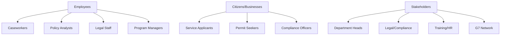
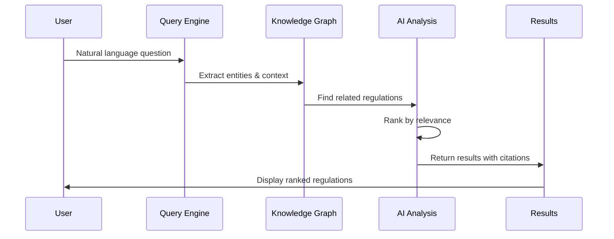
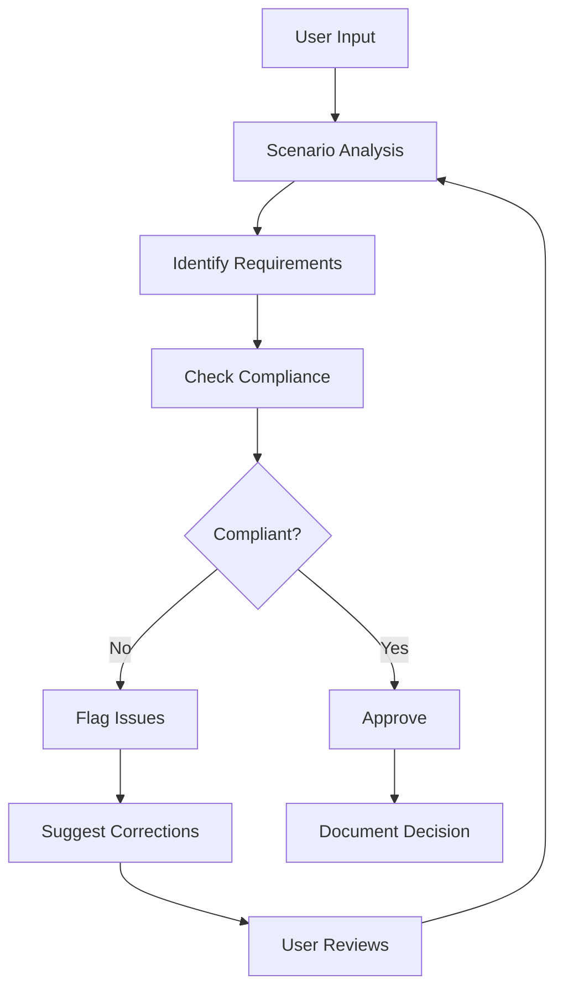
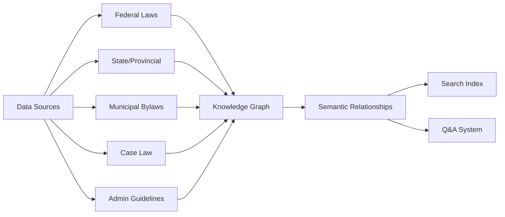
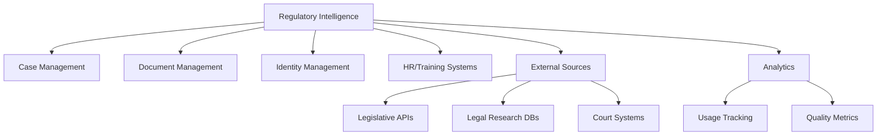
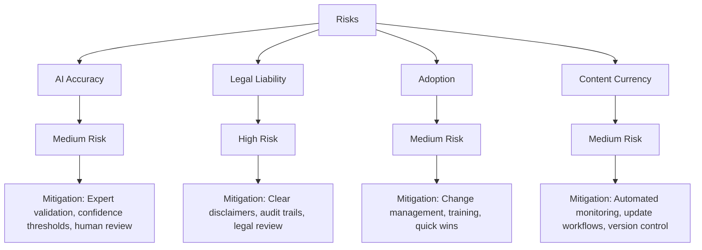

# Product Requirements Document: Regulatory Intelligence Assistant for Public Service

## Executive Summary

**Product Name:** Regulatory Intelligence Assistant for Public Service  
**Version:** 1.0  
**Date:** November 18, 2025  
**Project Context:** G7 GovAI Grand Challenge - Statement 2 (Navigating Complex Regulations)  
**Priority:** High  
**Project Impact:** High - Critical for improving decision consistency and reducing employee cognitive load

### Vision
Transform how public servants navigate regulatory complexity by creating an AI-powered intelligent assistant that provides instant access to relevant laws and policies, ensures consistent interpretation, and reduces cognitive burden—enabling employees to focus on serving citizens rather than researching regulations.

### Success Criteria
- 60-75% reduction in time spent researching regulations
- 80% reduction in decision inconsistencies across employees
- 90% reduction in regulatory interpretation errors
- 75%+ search accuracy (precision and recall)
- 50% reduction in training time for new employees

## Project Context

### G7 GovAI Challenge Context
- **Competition Period:** November 17 - December 1, 2025
- **Host:** Government of Canada (Treasury Board Secretariat)
- **Objective:** Streamline interpretation and application of rules to increase consistency and compliance, reducing cognitive load on employees
- **Funding:** Up to $10,000 CAD for selected solutions
- **Scope:** Two-week rapid solution design, followed by potential partnership with G7 governments

### Target Users & Stakeholders

## User Stories

### Epic 1: Regulatory Search & Discovery

#### US-1.1: Natural Language Regulatory Search
**As a** caseworker  
**I want to** search regulations using plain language questions  
**So that** I can quickly find relevant rules without knowing exact legal terminology

**Acceptance Criteria:**
- Natural language query processing (e.g., "Can someone with a work permit apply for benefits?")
- Search across federal, provincial/state, municipal regulations
- Results ranked by relevance with confidence scores
- Response time <3 seconds for 95% of queries
- Query suggestions and autocomplete
- Search history tracking

#### US-1.2: Contextual Regulation Identification
**As a** program officer  
**I want** the system to identify all applicable regulations for a specific scenario  
**So that** I don't miss any relevant legal requirements

**Acceptance Criteria:**
- Input scenario description (person type, situation, program)
- AI identifies all applicable laws and policies
- Cross-jurisdictional coverage (federal, state, municipal)
- Conflict detection between regulations
- Prioritized list with applicability explanations
- Citation links to source documents

### Epic 2: Decision Support & Guidance

#### US-2.1: Guided Workflow Assistance
**As a** new employee  
**I want** step-by-step guidance through complex regulatory processes  
**So that** I can make correct decisions without extensive training

**Acceptance Criteria:**
- Pre-built workflows for common scenarios
- Dynamic branching based on user responses
- Plain language explanations at each step
- Required documentation checklist
- Validation of inputs before submission
- Escalation triggers for complex cases

#### US-2.2: Compliance Checking
**As a** supervisor  
**I want** real-time compliance checking of decisions  
**So that** I can prevent non-compliant outcomes before they occur

**Acceptance Criteria:**
- Real-time validation as forms are completed
- Highlight non-compliant fields with explanations
- Suggest corrections or alternatives
- Multi-level approval workflows
- Audit trail of all checks and overrides
- Compliance reports for management

### Epic 3: Knowledge Management & Learning

#### US-3.1: Regulatory Change Monitoring
**As a** policy manager  
**I want** automatic alerts when regulations affecting my programs change  
**So that** I can update processes proactively

**Acceptance Criteria:**
- Daily monitoring of official legislative sources
- AI-powered impact assessment of changes
- Email/dashboard alerts for relevant changes
- Comparison view (old vs. new regulations)
- Affected program identification
- Implementation timeline recommendations

#### US-3.2: Expert Knowledge Capture
**As a** legal advisor  
**I want** to validate and enrich AI recommendations with expert knowledge  
**So that** the system continuously improves accuracy

**Acceptance Criteria:**
- Expert review workflow for AI recommendations
- Feedback mechanism (correct/incorrect, comments)
- Knowledge base article creation from common queries
- Precedent documentation for edge cases
- Quality metrics dashboard
- Active learning from expert corrections

### Epic 4: Citizen Self-Service

#### US-4.1: Public Regulatory Guidance
**As a** citizen  
**I want** to understand which regulations apply to my situation  
**So that** I can submit correct applications on my first attempt

**Acceptance Criteria:**
- Simplified citizen-facing interface
- Plain language explanations (no legal jargon)
- Interactive questionnaires to determine applicability
- Document requirement checklists
- Example scenarios and case studies
- Pre-submission compliance validation

#### US-4.2: Application Assistance
**As a** small business owner  
**I want** help understanding permit requirements  
**So that** I can obtain necessary approvals efficiently

**Acceptance Criteria:**
- Industry/business-specific guidance
- Jurisdiction-specific requirements
- Timeline estimates for approval
- Fee calculations
- Form pre-population from business registry
- Status tracking integration

## Functional Requirements

### FR-1: Regulatory Knowledge Base

**Requirements:**
- FR-1.1: System shall ingest regulations from official government sources
- FR-1.2: System shall maintain knowledge graph of legal relationships
- FR-1.3: System shall track historical versions and amendments
- FR-1.4: System shall support cross-jurisdictional mapping
- FR-1.5: System shall validate content authenticity cryptographically
- FR-1.6: System shall update content daily from monitored sources
- FR-1.7: System shall maintain 10+ years of regulatory history

### FR-2: Search & Query Processing
- FR-2.1: System shall process natural language queries
- FR-2.2: System shall extract entities (person types, situations, programs)
- FR-2.3: System shall return results in <3 seconds for 95% of queries
- FR-2.4: System shall rank results by relevance with confidence scores
- FR-2.5: System shall support hybrid search (keyword + semantic)
- FR-2.6: System shall provide query suggestions and autocomplete
- FR-2.7: System shall maintain user search history

### FR-3: Analysis & Recommendations
- FR-3.1: System shall identify all applicable regulations for scenarios
- FR-3.2: System shall detect conflicts between regulations
- FR-3.3: System shall assess regulatory change impacts
- FR-3.4: System shall match similar precedents and cases
- FR-3.5: System shall provide confidence scores for recommendations
- FR-3.6: System shall explain reasoning with citations
- FR-3.7: System shall support what-if scenario analysis

### FR-4: Guided Workflows
- FR-4.1: System shall provide step-by-step guidance for common processes
- FR-4.2: System shall adapt workflows based on user responses
- FR-4.3: System shall validate inputs in real-time
- FR-4.4: System shall generate decision documentation
- FR-4.5: System shall support multi-level approvals
- FR-4.6: System shall maintain audit trail of all decisions
- FR-4.7: System shall enable custom workflow creation

### FR-5: Change Management
- FR-5.1: System shall monitor official legislative sources daily
- FR-5.2: System shall detect new and amended regulations
- FR-5.3: System shall assess impact on existing programs
- FR-5.4: System shall generate change notifications
- FR-5.5: System shall provide comparison views (old vs. new)
- FR-5.6: System shall recommend implementation timelines

## Non-Functional Requirements

### NFR-1: Performance
- NFR-1.1: Search response time: <3 seconds for 95% of queries
- NFR-1.2: Knowledge graph update: Daily automated processing
- NFR-1.3: Recommendation generation: <5 seconds
- NFR-1.4: System uptime: >99.5% during business hours
- NFR-1.5: Concurrent users: Support 100+ simultaneous queries
- NFR-1.6: Page load time: <2 seconds

### NFR-2: Accuracy & Quality
- NFR-2.1: Search precision: >75% for test queries
- NFR-2.2: Search recall: >75% for test queries
- NFR-2.3: Recommendation accuracy: >85% validated by experts
- NFR-2.4: Content authenticity: Cryptographic verification
- NFR-2.5: Update frequency: New regulations reflected within 24 hours

### NFR-3: Security & Compliance
- NFR-3.1: Role-based access control (RBAC) by organizational role
- NFR-3.2: Multi-factor authentication for employee access
- NFR-3.3: Audit logging of all queries and recommendations
- NFR-3.4: No storage of personal case data (anonymized patterns only)
- NFR-3.5: Data residency compliance (Canada/US jurisdictions)
- NFR-3.6: Regular security audits and penetration testing

### NFR-4: Usability
- NFR-4.1: User satisfaction: >4/5 rating
- NFR-4.2: Weekly active users: >70% of pilot employees
- NFR-4.3: First-time success rate: >80% without training
- NFR-4.4: Accessibility: WCAG 2.1 AA compliance
- NFR-4.5: Mobile responsiveness: Full functionality on tablets
- NFR-4.6: Multi-language: English and French (MVP)

### NFR-5: Explainability & Trust
- NFR-5.1: All recommendations must include reasoning
- NFR-5.2: All results must cite source regulations
- NFR-5.3: Confidence scores must be displayed
- NFR-5.4: Uncertainty must be clearly indicated
- NFR-5.5: Human oversight required for high-stakes decisions
- NFR-5.6: Bias audits conducted quarterly

## System Integration

### Integration Architecture

### Integration Points
1. **Case Management Systems:** Query integration, decision documentation
2. **Document Management:** Regulation storage, version control
3. **Identity & Access Management:** SSO, role-based access
4. **HR/Training Systems:** User profiles, training completion
5. **Legislative Databases:** Parliament/Congress, provincial/state assemblies
6. **Legal Research Databases:** CanLII, WestLaw, LexisNexis
7. **Court Systems:** Case law and precedents
8. **Public Portals:** Citizen-facing self-service
9. **Analytics Platforms:** Usage and quality monitoring
10. **Notification Systems:** Email, SMS for alerts

## Dependencies

### Technology Dependencies
- **Frontend:** React/Next.js, React Native (mobile)
- **Backend:** Python (FastAPI), Node.js
- **AI/ML:** GPT-4, Claude, Gemini API, Hugging Face, LegalBERT
- **Search:** Elasticsearch, Pinecone/Weaviate (vector DB)
- **Knowledge Graph:** Neo4j
- **Databases:** PostgreSQL, Redis
- **Cloud:** AWS/Azure/GCP

### External Service Dependencies
- Legislative database APIs (where available)
- Legal research database subscriptions (CanLII, etc.)
- AI/ML APIs (OpenAI, Anthropic, Google)
- OCR services for scanned documents
- Translation services (for bilingual support)

### Government System Dependencies
- Case management platforms
- Document/records management systems
- Identity and access management
- Employee directories
- Public service portals

## Success Metrics

### Efficiency Metrics
- Regulatory research time: -60-75% reduction
- Case processing time: -40-50% reduction
- Cases per employee: +30% capacity increase
- Training time: -50% for new employees
- Supervisor escalations: -50% reduction

### Quality Metrics
- Decision consistency: +80% improvement
- Interpretation errors: -90% reduction
- Compliance rate: +70% improvement
- Search precision: >75%
- Search recall: >75%
- Recommendation accuracy: >85%

### Adoption Metrics
- Weekly active users: >70%
- Query volume: 500+ queries/week
- User satisfaction: >4/5 rating
- Feature adoption: >60% use guided workflows
- Expert validation: 100+ monthly reviews

### Impact Metrics
- Cost savings: $2-5M annually per large department
- Legal challenges: -30-40% reduction
- Appeals: -30-40% reduction
- ROI: $200K+ demonstrated in pilot
- Confidence: 80% report increased decision confidence

## Timeline & Milestones

### 2-Week MVP Sprint (Nov 17 - Dec 1, 2025)

**Team Composition (4 people):**
- 1 Full-Stack Developer (React + Python/FastAPI)
- 1 AI/ML Engineer (Legal NLP, RAG, Knowledge Graphs)
- 1 Legal/Domain Expert (Regulation Curation, Testing)
- 1 UX Designer/Frontend Developer (Interface, Workflows)

**Week 1: Foundation & Knowledge Base**
- Days 1-2: Architecture design, project setup, vector DB configuration
- Days 3-4: Regulatory document ingestion (50-100 sample regulations)
- Days 5-7: Knowledge graph construction, semantic search prototype

**Week 2: Search & Demo**
- Days 8-10: Natural language Q&A interface, guided workflows
- Days 11-12: Compliance checking prototype, user testing
- Days 13-14: Demo preparation, documentation, video submission

**MVP Deliverables (2-Week Scope):**
- Ingest 50-100 regulatory documents (2-3 program areas)
- Basic knowledge graph with regulation relationships
- Natural language search with citations
- Simple Q&A interface for regulatory queries
- Guided workflow prototype for 1-2 common scenarios
- Basic compliance checking for sample forms
- Demo video showing search, Q&A, and compliance features
- Architecture documentation for scaling

**Post-Challenge Roadmap (If Selected):**
- Months 1-3: Expand to 500-1000 documents, multi-department
- Months 4-6: Deploy to 2-3 departments, 200-500 users
- Months 7-12: Multi-jurisdiction, citizen portal, mobile apps

## Risk Assessment

### Risk Mitigation Strategies

**AI Accuracy Risk:**
- Expert validation workflow for all recommendations
- Confidence thresholds for automatic vs. human review
- Continuous learning from expert corrections
- A/B testing of model improvements
- Regular accuracy audits

**Legal Liability Risk:**
- Clear disclaimers about AI advisory nature
- Complete audit trails for accountability
- Legal team review of high-risk recommendations
- Insurance and indemnification planning
- Human-in-the-loop for final decisions

**Adoption Risk:**
- Change management program with executive sponsorship
- Comprehensive training and support
- Quick wins demonstrated early
- Champions network across departments
- User feedback loop for improvements

**Content Currency Risk:**
- Automated daily monitoring of legislative sources
- Expert-validated update workflows
- Version control with change tracking
- Subscription alerts for affected users
- Quarterly content audits

---

**Document Version:** 1.0  
**Last Updated:** November 18, 2025  
**Status:** Draft - G7 Challenge Submission
