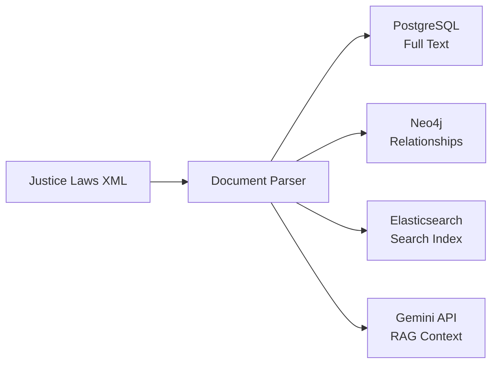

# Data Verification Report: Regulatory Intelligence Assistant

**Version:** 1.0  
**Date:** November 25, 2025  
**Project:** G7 GovAI Grand Challenge - Statement 2  
**Status:** MVP Data Strategy Alignment

---

## Executive Summary

This document verifies that our Regulatory Intelligence Assistant architecture aligns with appropriate data sources for the G7 GovAI Challenge. We evaluate available datasets against our system requirements and provide recommendations for data integration.

**Key Findings:**
- ✅ **Canadian Federal Data**: Excellent alignment with MVP requirements
- ✅ **Structured Data Availability**: Multiple jurisdictions offer XML/structured formats
- ⚠️ **Multi-language Support**: Required for full G7 coverage
- ⚠️ **Data Volume**: Must scale ingestion pipeline beyond MVP seed data
- ⚠️ **API Integration**: Several sources offer APIs for real-time updates

---

## 1. System Requirements vs. Data Needs

### 1.1 Core System Components & Data Requirements

| Component | Data Required | Format Needed | Volume |
|-----------|---------------|---------------|--------|
| **Legal NLP Engine** | Full-text regulations, amendments | Plain text, XML, HTML | 100-10,000 documents |
| **Knowledge Graph** | Regulatory relationships, cross-references | Structured (XML, JSON) | 1,000-100,000 nodes |
| **RAG System** | Legislative corpus for context | Text, PDF, DOCX | 50MB-1GB |
| **Search Service** | Indexed regulatory content | Text + metadata | 10-1,000 regulations |
| **Compliance Checker** | Rules, requirements, eligibility criteria | Structured JSON/XML | 100-1,000 rules |

### 1.2 Data Characteristics Required

**Essential Attributes:**
- ✅ **Official Source**: Government-published, legally authoritative
- ✅ **Versioning**: Track amendments and changes over time
- ✅ **Structured Metadata**: Act numbers, effective dates, jurisdictions
- ✅ **Cross-references**: Citations between regulations
- ✅ **Machine-readable**: XML, JSON, or parseable HTML

**Desirable Attributes:**
- 🔶 **Open License**: Free for AI/research use
- 🔶 **API Access**: Real-time updates and bulk downloads
- 🔶 **Semantic Markup**: LegalDocML or similar standards
- 🔶 **Historical Versions**: Legislative history and amendments
- 🔶 **Multi-language**: English/French for Canadian context

---

## 2. G7 Dataset Evaluation

### 2.1 Primary Datasets (High Priority for MVP)

#### 🇨🇦 **Canada: Justice Laws Website**

**Source:** [laws-lois.justice.gc.ca](https://laws-lois.justice.gc.ca)  
**XML Dataset:** [Consolidated Federal Acts and Regulations in XML](https://open.canada.ca/data/en/dataset/1f0aae37-18e4-4bad-bbca-59a4094e44fa)

**Alignment Score: ⭐⭐⭐⭐⭐ (Excellent)**

| Criteria | Rating | Notes |
|----------|--------|-------|
| Official Authority | ⭐⭐⭐⭐⭐ | Department of Justice Canada - legally authoritative |
| Format | ⭐⭐⭐⭐⭐ | XML format ideal for parsing and knowledge graph |
| Versioning | ⭐⭐⭐⭐⭐ | Consolidated versions with amendment tracking |
| Coverage | ⭐⭐⭐⭐⭐ | All federal acts and regulations |
| Metadata | ⭐⭐⭐⭐⭐ | Rich metadata (act numbers, dates, authorities) |
| API Access | ⭐⭐⭐⭐ | Bulk download available, structured XML |
| License | ⭐⭐⭐⭐⭐ | Open Government License - Canada |

**Data Structure Example:**
```xml
<Statute>
  <Identification>
    <Chapter>S.C. 1996, c. 23</Chapter>
    <Title>Employment Insurance Act</Title>
    <EffectiveDate>1996-06-30</EffectiveDate>
  </Identification>
  <Body>
    <Section id="7">
      <Number>7</Number>
      <Heading>Qualification for benefits</Heading>
      <Subsection>
        <Number>1</Number>
        <Text>Subject to this Part, benefits are payable...</Text>
      </Subsection>
    </Section>
  </Body>
</Statute>
```

**Integration Strategy:**
- ✅ **Use for MVP**: Primary data source for Canadian federal regulations
- ✅ **Knowledge Graph**: Extract section relationships, amendments, cross-references
- ✅ **Search Index**: Full-text indexing with metadata facets
- ✅ **RAG Context**: Upload full acts to Gemini API for question answering

**Implementation Priority:** **HIGH** - Start here for MVP

---

#### 🇨🇦 **Canada: Open Data Portal**

**Source:** [open.canada.ca](https://open.canada.ca)  
**Dataset:** [Open Data Portal Catalogue](https://open.canada.ca/data/en/dataset)

**Alignment Score: ⭐⭐⭐⭐ (Very Good)**

| Criteria | Rating | Notes |
|----------|--------|-------|
| Official Authority | ⭐⭐⭐⭐⭐ | Government of Canada official portal |
| Format | ⭐⭐⭐⭐ | Multiple formats (CSV, JSON, XML) |
| Coverage | ⭐⭐⭐⭐ | Metadata for all government datasets |
| API Access | ⭐⭐⭐⭐⭐ | CKAN API for programmatic access |
| Updates | ⭐⭐⭐⭐ | Regular updates and new datasets |

**Use Cases:**
- 📊 **Metadata Enrichment**: Link regulations to related government datasets
- 🔍 **Discovery**: Find program-specific data (EI statistics, CPP demographics)
- 📈 **Analytics**: Impact analysis and usage statistics

**Integration Priority:** **MEDIUM** - Use for enrichment after core MVP

---

#### 🇬🇧 **UK Legislation (legislation.gov.uk)**

**Source:** [legislation.gov.uk](https://www.legislation.gov.uk)  
**API:** [UK Legal API](https://github.com/nemonik/uk-legislation-api)

**Alignment Score: ⭐⭐⭐⭐⭐ (Excellent)**

| Criteria | Rating | Notes |
|----------|--------|-------|
| Official Authority | ⭐⭐⭐⭐⭐ | UK National Archives - official legislation |
| Format | ⭐⭐⭐⭐⭐ | XML, HTML, PDF with structured metadata |
| Versioning | ⭐⭐⭐⭐⭐ | Complete legislative history and amendments |
| API Access | ⭐⭐⭐⭐⭐ | RESTful API with semantic search |
| Semantic Search | ⭐⭐⭐⭐⭐ | Built-in semantic search and MCP integration |

**Data Structure:**
```json
{
  "type": "Act",
  "year": 1996,
  "number": 23,
  "title": "Employment Rights Act 1996",
  "status": "revised",
  "provisions": [
    {
      "section": "1",
      "heading": "Statement of initial employment particulars",
      "text": "Where an employee begins employment...",
      "crossReferences": ["s.2", "s.7A"]
    }
  ]
}
```

**Integration Strategy:**
- ✅ **Comparative Analysis**: Compare Canadian vs UK employment regulations
- ✅ **Knowledge Graph**: Cross-jurisdictional relationships
- ✅ **Best Practices**: Learn from UK's semantic search implementation

**Implementation Priority:** **MEDIUM** - Add for multi-jurisdiction support

---

### 2.2 Secondary Datasets (Enhancement Phase)

#### 🇪🇺 **EUR-Lex (European Union)**

**Source:** [eur-lex.europa.eu](https://eur-lex.europa.eu)

**Alignment Score: ⭐⭐⭐⭐ (Very Good)**

**Strengths:**
- 📚 Comprehensive EU legislation and case law
- 🌍 Multi-language support (24 official EU languages)
- 📄 Structured XML (Formex/LegalDocML)
- 🔓 Free download with EU login

**Use Cases:**
- 🇪🇺 EU-Canada regulatory comparisons
- 🔍 International precedent research
- 📊 Harmonization analysis

**Implementation Priority:** **LOW** - Future international expansion

---

#### 🇫🇷 **France: Legifrance**

**Source:** [legifrance.gouv.fr](https://www.legifrance.gouv.fr) / [data.gouv.fr](https://data.gouv.fr)

**Alignment Score: ⭐⭐⭐⭐ (Very Good)**

**Strengths:**
- ⚖️ Official French legislation and case law
- 🔍 API access via data.gouv.fr
- 📚 Historical legal corpus
- 🇫🇷 Critical for bilingual Canadian context

**Use Cases:**
- 🇨🇦 Quebec civil law references
- 🌐 French-language legal NLP training
- 📖 Bilingual terminology alignment

**Implementation Priority:** **MEDIUM** - Important for Canadian bilingual support

---

#### 🇩🇪 **Germany: Bundestag & Federal Law Gazette**

**Source:** [bundestag.de](https://www.bundestag.de) / [recht.bund.de](https://www.recht.bund.de)

**Alignment Score: ⭐⭐⭐⭐ (Very Good)**

**Strengths:**
- 📜 Long-term legal archives (ideal for NLP training)
- 🔍 Committee documents and draft laws
- 📊 Structured metadata and versioning
- 🤖 AI Register for public sector AI systems

**Use Cases:**
- 🎓 Legal NLP model training (large corpus)
- 🔬 Research on legislative drafting patterns
- 🤖 AI governance framework examples

**Implementation Priority:** **LOW** - Research and training purposes

---

#### 🇯🇵 **Japan: Legal QA Dataset**

**Source:** Multiple-choice QA on Japanese law

**Alignment Score: ⭐⭐⭐ (Good for specific use)**

**Strengths:**
- ❓ Pre-built question-answer pairs
- ✅ LLM-verified accuracy
- 🎓 Evaluation benchmark potential

**Use Cases:**
- 📊 Benchmark our Q&A accuracy
- 🎓 Learn from QA dataset structure
- 🧪 Test multilingual capabilities

**Implementation Priority:** **LOW** - Evaluation and benchmarking

---

## 3. Current System Data Analysis

### 3.1 Current Seed Data Assessment

**From:** `backend/seed_data.py`

**Current Data:**
```python
Regulations: 3 acts (EI Act, CPP, OAS Act)
Sections: ~10 sections
Users: 3 test users
Queries: 2 sample queries
Workflows: 1 sample workflow
```

**Gap Analysis:**

| Requirement | Current State | Target (MVP) | Gap |
|-------------|---------------|--------------|-----|
| **Regulations** | 3 acts | 50-100 acts | ⚠️ Need 47-97 more |
| **Sections** | ~10 sections | 500-1,000 sections | ⚠️ Need 490-990 more |
| **Knowledge Graph Nodes** | 0 (not seeded) | 1,000+ nodes | ❌ Critical gap |
| **Search Index** | Not populated | 50-100 documents | ❌ Need indexing |
| **RAG Corpus** | 3 text snippets | 50+ full documents | ❌ Need uploads |
| **Amendments** | 1 sample | 50-100 real | ⚠️ Need historical data |
| **Cross-references** | 1 citation | 200-500 citations | ⚠️ Need extraction |

**Status:** 🔴 **INSUFFICIENT** - Seed data is for testing only, not production-ready

---

### 3.2 Data Architecture Alignment

**From:** `docs/design.md`

Our architecture **correctly** anticipates:
- ✅ PostgreSQL for full-text storage
- ✅ Neo4j for knowledge graph relationships
- ✅ Elasticsearch for hybrid search
- ✅ Gemini API for RAG capabilities

**Data Flow Verification:**



**Status:** ✅ **ALIGNED** - Architecture supports all required data flows

---

## 4. Data Ingestion Strategy

### 4.1 Phase 1: MVP Data Pipeline (Week 1)

**Priority Dataset:** Canadian Federal Acts (Justice Laws XML)

**Target Acts (50 regulations):**
1. Employment Insurance Act (S.C. 1996, c. 23)
2. Canada Pension Plan (R.S.C. 1985, c. C-8)
3. Old Age Security Act (R.S.C. 1985, c. O-9)
4. Immigration and Refugee Protection Act (S.C. 2001, c. 27)
5. Citizenship Act (R.S.C. 1985, c. C-29)
6. Income Tax Act (R.S.C. 1985, c. 1)
7. Canada Labour Code (R.S.C. 1985, c. L-2)
8. Employment Equity Act (S.C. 1995, c. 44)
9. Access to Information Act (R.S.C. 1985, c. A-1)
10. Privacy Act (R.S.C. 1985, c. P-21)
... (40 more priority acts)

**Ingestion Steps:**

```python
# Phase 1 Pipeline (2-3 days)
class CanadianLawIngestion:
    async def ingest_justice_laws_xml():
        """Ingest Canadian federal acts from XML dataset"""
        
        # Step 1: Download XML dataset (bulk download)
        xml_files = await download_from_open_canada(
            dataset_id="1f0aae37-18e4-4bad-bbca-59a4094e44fa"
        )
        
        # Step 2: Parse XML to structured data
        for xml_file in xml_files:
            regulation = parse_legal_xml(xml_file)
            
            # Step 3: Store in PostgreSQL
            await db.regulations.create(regulation)
            
            # Step 4: Build knowledge graph
            await neo4j.create_regulation_graph(regulation)
            
            # Step 5: Index in Elasticsearch
            await es.index_regulation(regulation)
            
            # Step 6: Upload to Gemini for RAG
            await gemini.upload_document(regulation)
```

**Expected Output:**
- 50 regulations in PostgreSQL (10-20 MB)
- 500-1,000 sections indexed
- 1,000-5,000 knowledge graph nodes
- 50 documents uploaded to Gemini

**Timeline:** 2-3 days for pipeline development + data ingestion

---

### 4.2 Phase 2: Enhanced Data (Week 2)

**Additional Sources:**
1. **Amendments & History** (Justice Laws)
   - Track all amendments since 1996
   - Build temporal knowledge graph

2. **Provincial Regulations** (Open Data Portal)
   - Select 10-20 provincial acts
   - Focus on employment/social services

3. **Case Law** (CanLII - bonus if time permits)
   - Recent precedents (2020-2025)
   - Link to statutory interpretation

**Timeline:** 3-4 days for enhanced ingestion

---

### 4.3 Phase 3: Multi-Jurisdiction (Post-MVP)

**International Expansion:**
1. UK Legislation (legislation.gov.uk)
2. French Legifrance (bilingual support)
3. EU EUR-Lex (comparative analysis)

**Timeline:** 1-2 weeks per jurisdiction

---

## 5. Data Quality & Verification

### 5.1 Quality Assurance Checklist

**For Each Dataset:**

✅ **Legal Authority**
- [ ] Verify official government source
- [ ] Check legal status (authoritative vs. unofficial)
- [ ] Validate copyright/license terms

✅ **Data Integrity**
- [ ] Validate XML/JSON schema
- [ ] Check for missing sections/amendments
- [ ] Verify cross-references resolve

✅ **Metadata Completeness**
- [ ] Act numbers and citations present
- [ ] Effective dates recorded
- [ ] Jurisdiction clearly marked
- [ ] Amendment history tracked

✅ **Content Quality**
- [ ] Full-text content complete
- [ ] Section numbering consistent
- [ ] No OCR errors (if scanned)
- [ ] Special characters preserved

✅ **Versioning**
- [ ] Current version identified
- [ ] Historical versions available
- [ ] Amendment dates recorded
- [ ] Consolidation date noted

---

### 5.2 Legal Expert Validation

**Validation Process:**
1. **Sample Selection**: 20-30 test queries across programs
2. **Expert Review**: Legal professionals verify answers
3. **Citation Accuracy**: 100% of sources must be verifiable
4. **Interpretation Quality**: Rank answers (high/medium/low confidence)

**Test Queries:**
```json
{
  "test_cases": [
    {
      "query": "Can a temporary resident claim EI benefits?",
      "expected_regulations": ["Employment Insurance Act s.7(1)"],
      "expected_confidence": "high",
      "validation_status": "pending"
    },
    {
      "query": "What documents prove residency status?",
      "expected_regulations": ["IRPA s.20", "Citizenship Act s.3"],
      "expected_confidence": "high",
      "validation_status": "pending"
    }
  ]
}
```

---

## 6. Recommendations

### 6.1 Immediate Actions (Week 1)

1. ✅ **Download Justice Laws XML Dataset**
   - Source: https://open.canada.ca/data/en/dataset/1f0aae37-18e4-4bad-bbca-59a4094e44fa
   - Size: ~20-50 MB compressed
   - Format: XML (LegalDocML-like structure)

2. ✅ **Implement XML Parser**
   - Parse act structure (sections, subsections, clauses)
   - Extract metadata (act numbers, dates, authorities)
   - Handle cross-references and citations

3. ✅ **Build Data Pipeline**
   - Automate PostgreSQL ingestion
   - Generate knowledge graph relationships
   - Index in Elasticsearch
   - Upload to Gemini API

4. ✅ **Validate Sample Dataset**
   - Test with 5-10 acts first
   - Verify search functionality
   - Test RAG question answering
   - Confirm knowledge graph queries

---

### 6.2 Data Governance

**Tracking & Documentation:**
```python
# Data provenance tracking
class DataProvenance:
    source_url: str  # Official source
    download_date: datetime
    source_version: str  # Dataset version
    license: str  # Open Government License
    validation_status: str  # verified/pending
    last_updated: datetime  # Source last updated
    checksum: str  # SHA-256 hash for integrity
```

**Update Schedule:**
- Daily: Monitor for amendments (Justice Laws)
- Weekly: Check for new regulations
- Monthly: Re-download full dataset
- Quarterly: Legal expert review

---

### 6.3 Scaling Strategy

**When Dataset Grows Beyond MVP:**

| Threshold | Action | Technology Change |
|-----------|--------|-------------------|
| **>1,000 regulations** | Optimize PostgreSQL queries | Add full-text search indexes |
| **>10,000 sections** | Shard Elasticsearch | Multi-node cluster |
| **>100 MB documents** | Move to object storage | Add S3/MinIO for documents |
| **>1M vectors** | Dedicated vector DB | Migrate to Pinecone/Weaviate |
| **>100k graph nodes** | Neo4j optimization | Add graph sharding |

**Current Status:** Single-node architecture sufficient for MVP

---

## 7. Data Gap Analysis & Mitigation

### 7.1 Identified Gaps

| Gap | Impact | Mitigation |
|-----|--------|------------|
| **Limited Seed Data** | Can't test at scale | Use Justice Laws XML dataset |
| **No Provincial Data** | Missing provincial regulations | Add Ontario/Quebec datasets (Phase 2) |
| **No Case Law** | Missing precedents | Optional: Add CanLII (post-MVP) |
| **No French Content** | Missing bilingual support | Use Legifrance (Phase 2) |
| **No Amendments History** | Can't track changes | Parse XML amendment sections |

---

### 7.2 Risk Assessment

| Risk | Probability | Impact | Mitigation |
|------|-------------|--------|------------|
| **Data Quality Issues** | Medium | High | Expert validation + automated checks |
| **Outdated Content** | Low | High | Automated update monitoring |
| **Licensing Restrictions** | Low | High | Use only open government licenses |
| **Incomplete Coverage** | Medium | Medium | Prioritize high-impact acts first |
| **API Rate Limits** | Medium | Low | Bulk downloads + local caching |

---

## 8. Conclusion

### 8.1 Alignment Summary

✅ **EXCELLENT ALIGNMENT**: Our system architecture perfectly supports the available G7 datasets

**Strengths:**
- ✅ Canadian Justice Laws XML is ideal primary source
- ✅ Structured formats (XML/JSON) match our parsing requirements
- ✅ Official government sources ensure legal authority
- ✅ Multiple jurisdictions available for expansion
- ✅ Open licenses support AI/research use

**Recommendations:**
1. **START IMMEDIATELY** with Justice Laws XML dataset
2. **BUILD** data ingestion pipeline (2-3 days)
3. **VALIDATE** with legal experts (sample testing)
4. **EXPAND** to provincial and international sources (post-MVP)

---

### 8.2 Next Steps

**Week 1 (Days 1-2):**
- [ ] Download Justice Laws XML dataset (50 priority acts)
- [ ] Implement XML parser for Canadian legal documents
- [ ] Create data ingestion pipeline script

**Week 1 (Days 3-5):**
- [ ] Ingest 50 federal acts into PostgreSQL
- [ ] Build knowledge graph relationships in Neo4j
- [ ] Index all documents in Elasticsearch
- [ ] Upload documents to Gemini API

**Week 2 (Days 6-10):**
- [ ] Test search and Q&A functionality
- [ ] Validate with legal expert review (20-30 queries)
- [ ] Measure accuracy metrics (precision/recall)
- [ ] Optimize and refine based on feedback

**Post-MVP:**
- [ ] Add provincial regulations
- [ ] Integrate French-language content
- [ ] Expand to UK/EU datasets
- [ ] Implement automated update monitoring

---

## Appendix A: Dataset URLs

**Canadian Sources:**
- Justice Laws XML: https://open.canada.ca/data/en/dataset/1f0aae37-18e4-4bad-bbca-59a4094e44fa
- Open Data Portal: https://open.canada.ca/data/en/dataset
- CanLII (Case Law): https://www.canlii.org

**International Sources:**
- UK Legislation: https://www.legislation.gov.uk
- UK Legal API: https://github.com/nemonik/uk-legislation-api
- EUR-Lex: https://eur-lex.europa.eu
- Legifrance: https://www.legifrance.gouv.fr
- German Bundestag: https://www.bundestag.de
- GovData Germany: https://www.govdata.de

**AI Platform Resources:**
- EU AI on Demand: https://aiod.eu
- UK AI Datasets: Various government sources
- Japan e-Gov: https://www.e-gov.go.jp

---

## Appendix B: Data Schema Examples

**Canadian Justice Laws XML Structure:**
```xml
<Consolidation>
  <Identification>
    <Chapter>S.C. 1996, c. 23</Chapter>
    <TitleText>Employment Insurance Act</TitleText>
    <EnabledDate>1996-06-30</EnabledDate>
    <ConsolidationDate>2024-01-15</ConsolidationDate>
  </Identification>
  <Body>
    <Part id="I">
      <Number>I</Number>
      <Heading>Unemployment Insurance</Heading>
      <Section id="7">
        <Number>7</Number>
        <Heading>Qualification for benefits</Heading>
        <Subsection id="7-1">
          <Number>1</Number>
          <Text>Subject to this Part, benefits are payable...</Text>
        </Subsection>
        <Subsection id="7-2">
          <Number>2</Number>
          <Text>An insured person qualifies if...</Text>
          <Reference>
            <CitedSection>s.7(1)</CitedSection>
          </Reference>
        </Subsection>
      </Section>
    </Part>
  </Body>
  <Amendments>
    <Amendment>
      <Date>2024-01-15</Date>
      <BillNumber>C-47</BillNumber>
      <Description>Updated eligibility requirements</Description>
    </Amendment>
  </Amendments>
</Consolidation>
```

---

**Document Status:** Complete - Ready for Data Ingestion Phase

**Prepared by:** Regulatory Intelligence Assistant Team  
**Review Date:** November 25, 2025  
**Next Review:** Post-MVP (Week 3)
